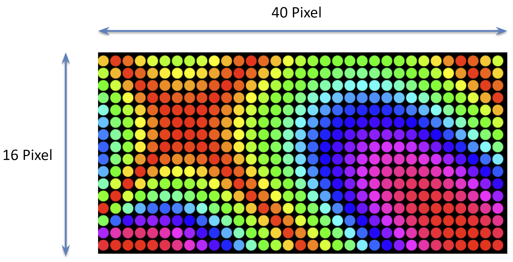
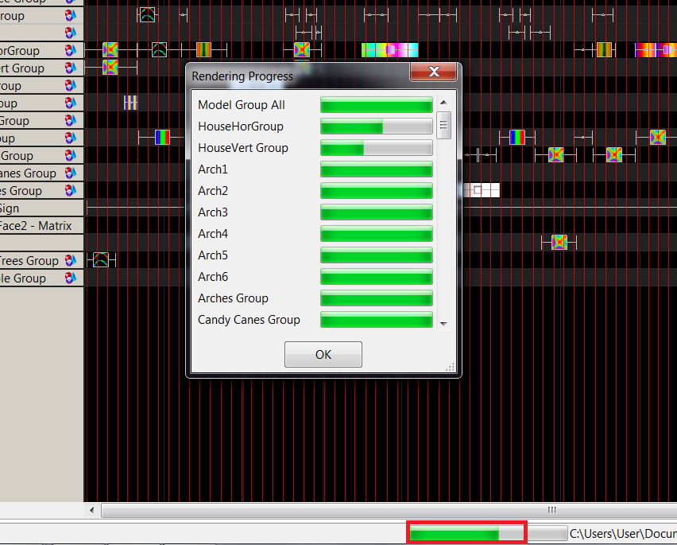
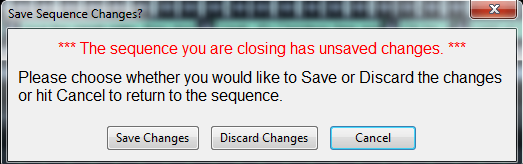

# File

## File

The File menu enables you to create a new xLights sequence, open an existing xLights sequence, Save, Save As or Close a sequence that is currently open, select a show directory, backup xLights sequences to another directory and quit the xLights application. These actions can also be done using shortcut keys and via icons on the top bar of the canvas.

.png>)

###  New Sequence

Create a new sequence, either a musical or animation. See New Sequence Page for more information


[new-sequence.md](new-sequence.md)


.png>)

###  Open Sequence

To open an existing sequence, either use the Open Sequence icon, select Open Sequence from the File menu or press Ctrl O. You will be presented with the ‘Choose Sequence file to open’ window, with the directory defaulting to your show directory. Select the required xLights (XSQ or XML) sequence file to open. You can also select the FSEQ file and it will open the XSQ or XML file referenced within.

###  Open Recent Sequence

To open a recently used sequence, select any item from this list.

###  Save Sequence

To save an open sequence, either use the Save Sequence icon, select Save Sequence from the File menu or press Ctrl S. If the sequence has not been saved previously, you will be presented with the Save As dialogue window to enter the name for the sequence.&#x20;

If the Render on Save setting (under the Settings menu) is set (i.e. checked) then all the effects on all the models will be rendered first before the sequence is saved in the FSEQ file. This is the default. Progress status messages are displayed on the last line of the window with a progress bar indicating the render progress.

When the sequence has completed saving, a message will be displayed on the last line indicating the name of the FSEQ file and how long the save process took.

If you click on the green progress bar, a window opens and you can see the render progress of each model / model group.

One line is displayed for each model or Model group that is being rendered.

You can stretch and expand the window to see all the models.

###  Save As Sequence

To save an open sequence with a different name, either use the Save As Sequence icon or select Save As Sequence from the File menu. You will be presented with the Save As dialogue window to enter the name for the sequence. If the Render on Save setting (under the Settings menu) is set (i.e. checked) then all the effects on all the models will be rendered first before the sequence is saved in the FSEQ file. This is the default. Progress status messages are displayed on the last line of the window. When the sequence has completed saving, a message will be displayed on the last line indicating the name of the FSEQ file and how long the save process took.

.png>)

### Close Sequence

To close the currently open sequence, select Close Sequence from the File menu. If the sequence data has not been saved since the last change, you will be presented with warning.

Click on Save Changes if you want to save your changes. If you click Cancel then you will be returned to the sequence. If you select and click Discard Changes, then the sequence will be closed without any sequence changes being saved.

### Preferences

.png>)

The Preferences Dialog allows the user to set all the global settings in xLights. These settings are stored in the system register and are persistent between show folders.


[settings](settings/)


.png>)

### Sequence Setting

.png>)

The Sequence Settings Dialog allows the user to edit all the settings for the currently open sequence. See Sequence Settings page for more information.


[sequence-settings.md](sequence-settings.md)


.png>)

### Key bindings

.png>)

The Key bindings Dialog allows the user to manually edit the keyboards shortcuts in xLights.

.png>)

### Export House Preview Video

The Export House Preview Video feature will "Play" the loaded sequence and create a video file of the House Preview Window. The video resolution of the resulting file is based on House Preview size. It is recommended you make the House Preview Window as large as possible before selecting this option.

.png>)

###  Select Show Folder

In order to change your show Directory, select Select Show Folder from the File menu, press F9 or click on the Change button against the Show Directory on the Setup tab.You will be prompted to navigate to and select a new directory folder to select.

Ensure that you have the correct xLights XML files (xlights\_keybindings.xml, xlights\_networks.xml and xlights\_rgbeffects.xml) in your new directory.

###  Recent Show Folder

This option will display a list of previously selected show directories. If you select any of the items listed, your show directory will be changed to the selected directory.

.png>)

### Backup

The Backup Menu item allows you to manually trigger a backup of the show folder.

.png>)

You will be presented will a message indicating where a backup will be created. Click Yes to proceed.\
Every time this step is executed, a copy will be created of all the ‘\*xml’ files from your show directory into the Backup subdirectory of your show directory. A new subfolder is created each time a backup is executed.


[backup-and-recovery.md](backup-and-recovery.md)



By default xlights backs up the key files at the start of a session when xLights is launched.



Pressing F10 anytime, anywhere will backup your XML files for you and store them in a new folder with the date/time embedded in the name the backup was created. You can press F10 as many times as you like and should do this at least once per sequencing session. Keep in mind that you must have saved at least once in order for an updated XML file to be protected.


### Alternate Backup

The Alternate Backup function enables you to specify and use a different location to back your files up, other than the default location that the F10 backup functionality provides for.

Press F11 or select this function from the File menu. The first time you use this function, you will be prompted for the location that you wish to back the files to. Navigate to the required location and select the folder. The prompts after that are similar to the Backup functions.

.png>)

Subsequently, Pressing F11 will save the files to the specified location. You can change this location via the Settings, Alt Backup Location menu.


The F11 function does not do an auto (in memory) backup of the current sequence if you have one open. It will backup the open sequence XML contents from when it was last saved.


### Quit

To quit xLights, select Quit from the File menu or press ALT+F4.

If you have a sequence open and the sequence data has not been saved since the last change, you will be presented with the Save Sequence Dialog.

.png>)

