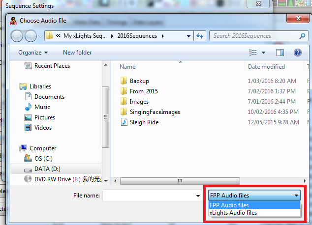
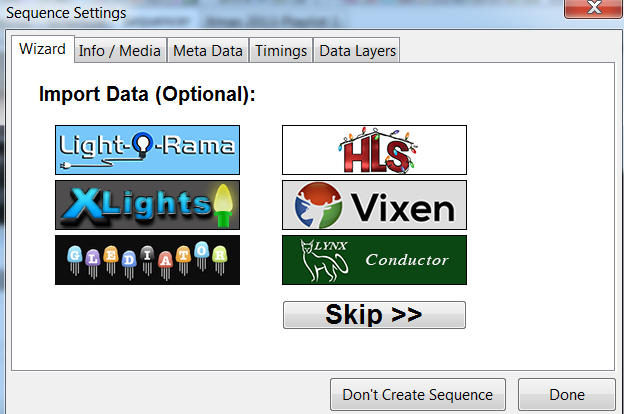
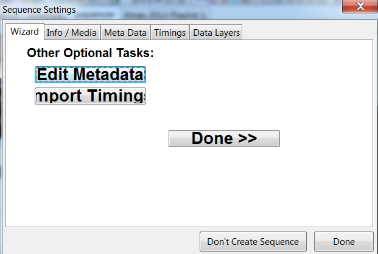
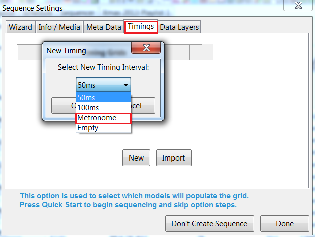
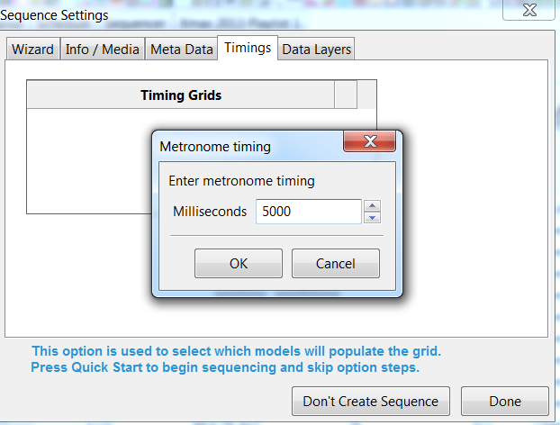

# New Sequence

To create a new sequence, either use the New Sequence icon, select New Sequence from the File menu or press Ctrl N.  The following screen is displayed:

.png>)


If you do change your mind about creating a sequence, click on the Don’t Create Sequence button.


### Musical Sequence

If creating a music sequence, click on Musical Sequence.  A ‘Choose Audio File’ window will open, defaulting to your media directory.

You can select ‘FPP Audio files’ or ‘xLights Audio files’ to filter which file types can then be selected.

FPP Audio files: \*.mp3;\*.ogg;\*.m4p;\*.mp4

xLights Audio files: \*.mp3;\*.ogg;\*.m4p;\*.mp4;\*.avi; \*.wma;\*.au;\*.wav;\*.m4a;\*.mid;\*. mkv;\*.mov;\*.mpg; \*.asf;  \*.flv;\*.mpeg.

If in doubt, select FPP Audio files.


The most common supported files on the FFP are .mp3 and .ogg. There is limited support for .mp4 and .m4p files for audio.  Constant Bit Rate (CBR) audio works well. Variable Bit Rate(VBR) is quite uncommon.


Select the frames per second (fps) for your sequence.

.png>)

The most common one used is 20fps (50ms).

On the Timing tab you can select one or more of a number of timing bar options,  which will generate timing marks automatically (similar to those that can be done via Audacity). &#x20;

If intending to create an xLights sequence, on the next screen, select the View that you wish to use on the sequencer screen (use the Drop down if the View displayed is not what you require) and then press Quick Start.

The next screen displayed will be the sequencer grid and all the models from the selected View, will be displayed.

If you selected More options from the previous screen, then you are presented with this screen.

If creating an xLights sequence, at this stage you can select ‘Done’ and import timing marks later (either via the Timings menu or by Right Clicking on the Sequencer menu).  Alternatively, you can click on the Timings tab now – this will lead to the Timings menu.

Press either Skip or click on Done.  If you pressed Skip then the following screen is displayed:

If you click on the Edit Metadata tab, this will lead to the Sequence Settings dialog box.  You can Import a Timing Track or click on any of the tabs for the corresponding functionality.

Click on Done when complete.

At this stage a new empty sequence has been created. You can...

* Select Save to save the sequence in your show directory – you will be prompted for a sequence name.
* Click on the Sequencer tab and continue with
  * Adding models for this sequence to the sequencer view,
  * Creating/adding timing marks
  * Dropping effects on the sequencer grid
  * Playing the sequence


Ensure that you save the sequence prior to exiting to save the work that has been done so far. By default though, the layout and sequencer changes are saved every 3 mins to a backup file i.e. ‘xxx.xbkp’ file in your show directory (where xxx is the name of the sequence).


### Animation Sequence

If creating an animation sequence, click on Animation Sequence.  No media/audio file is required or requested for.

### Metronome Timing Track

This option enables you to create a timing track with marks at fixed intervals of your choice e.g every 1 second or every 5 secs.  This is especially useful for animation sequences so that you don’t then have to go through and create timing marks manually.

Click on Timing and then from the drop down window , select the Metronome option.

In the popup window select the timing interval between each mark in milli secs ie 1000 for every 1 sec,  5000 for 5 every secs etc.

It must be a multiple of the base timing selected (ie 50 millisecs if 20fps was selected on the previous screen).

Click on Done when complete.  xLights will create a Timing track with timing marks at the specified intervals.

The subsequent process is the same as in the Musical Sequence. By default, xLights will create an animated  sequence that is 30 seconds in length. To change this , click on File, Sequence Settings and you can change the Sequence Duration.

.png>)

.png>)

