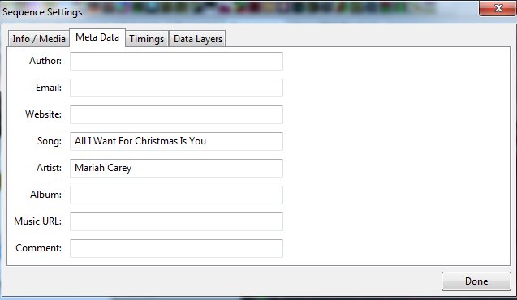

# Sequence Settings

## Sequence Settings

.png>)

Select the Sequence Settings option from the File menu. This screen can also be accessed by clicking on the button of the toolbar. The Sequence Settings screen has four tabs.

.png>)

## Info/Media

The Info/Media tab displays information about the sequence including the xLights release that was used to create the sequence, the number of models saved, the Sequence Type (i.e. Media or Animated), if media has been specified then the name and location of the media file. The sequence duration, the sequence timing and whether the media tags should be overwritten.

The sequence type, media file name or location, the sequence duration and whether media tags can be overwritten can be changed from this tab after the sequence has been created.

.png>)

#### Sequence Duration

Sequence Duration determines the playback length of the sequence in seconds. For Media sequence types this is fixed to the media/audio file length used and cannot be changed.  Animated Sequence duration defaults to 30 seconds and can be changed to the new length from this dialog.

#### Sequence Timing

Sequence Timing dictates the playback speed of the sequence.  A Sequence Timing of 50 milliseconds would have a playback speed of 20 frames per second. Click the Question Mark to change the Sequence Timing.

$$
fps = 1000ms / sequence timing
$$

#### Allow Blending Between Models

Allow Blending Between Models determines if effects from the model groups blend with model level effects. If enabled the model groups effect data will be merged with the model effect data. If disabled models lower in the render order with override effect data of models higher in the render order.&#x20;

Changes to the length of sequence duration, Sequence Timing, and Allow Blending Between Models require a "Render All" for the change to take effect in the current open sequence.

## Metadata

The Metadata tab enables the media metadata to be entered or updated. The attributes supported are the author, email, website, song, artist, album, music url and a comment.

This information does not drive any functionality in xLights.

xLights will parse and retrieve the information from the media file. It won't update any information entered on the media/info screen unless the Overwrite Media Tags setting on the Media/Info screen is ticked.

After updating any data Click on Done to Update.

## Timings

The Timings tab enables you to create or import one or more sets of timing marks on timing tracks for the audio of your sequence.

.png>)

This screen is part of the flow when creating a new sequence or can be accessed via this tab at any time after creating a sequence to add additional timing tracks.

### New

Clicking on New will present you with a list of options. You can either select a fixed value such as 50 or 100 ms or select from one of the options in the list.

.png>)


This component uses the VAMP plugins to generate the timing marks.


Selecting one of the options then presents a window where you can either select the defaults or change the timing name or any of the plug-in settings.

.png>)

.png>)

Click Ok and the audio track will be analysed and a timing track will be created. You can then click New again to select another timing track (‘Beats’) to be created.

Click Done when complete.

### Import

The Import button enables you to import timing marks created externally for example using Audacity or where you have created a timing track manually or wish to import one from another sequencer in a supported format.

You will be presented with a window to navigate to and select a file containing the timing marks to import to the timing grid. This can be a text file (.txt), a LOR .LMS/.LAS file, Papagayo .PGO file, LSP File, or, xLights .XML/.xsq/.xtiming file.

.png>)

You can repeat this process to import another timing grid from the same file or from another file. Click Done when complete.

## Data Layers

.png>)

### Render Mode

If the Render Mode is set to Erase (which is the default value), then the fseq file is erased before every render. If set to Canvas Mode, then the data in the fseq is not cleared before a render, rendering is done over the old data.


If set to Canvas mode, deleting an effect will still show when played until it is overridden with a new effect. Imagine a 6 foot painting in which you paint over a 4 foot section. The 2 foot original section is still visible. This is the how canvas mode works.


### Data Layers

When should you use the data layer to import effects?

Typically if you have sequences from other sequencers such as LSP, LOR, Vixen, HLS that you wish to use within xLights. The imported sequence is mapped very efficiently as a data image rather than individual effects. After importing the sequencer you can:

* Save it ( an .fseq file is created) and run it within xLights or via the Falcon Player
* Add xLights effects to new models via the sequencer
* Selectively override some of the effects from the imported models within xLights.

You cannot however ‘edit’ any of the imported effects directly. In order to do that see the Import Effects function. The data layer embeds the CONVERT tab into the sequence. The process is used to convert an incoming file from another sequencer into an \*.iseq file. Therefore, Vix, Lms, Seq, and Hls data into an ISEQ file.

This conversion is done in two places.

* When you a import a data layer
* When you press the ‘Render All’ button

.png>)


The purpose of ‘Render All’ is to render all the effects and data layers to the sequence object without saving to disk. The already imported ISEQ file data is used. If the source (‘LMS’, ‘SEQ’, ‘HLS’ etc) file is changed, then you need to go to the Data Layer tab, click on that layer and select the Re-Import function.


### Import

Before using this function, a new sequence should have been created or an existing sequence opened.

.png>)

From the Main Menu tab, select Sequence Settings and then Data Layers.

Click on Import, navigate to where your input file (‘LMS’, ‘LSP’ etc) is, change the file type as required and select the file to be imported. Click ok.

.png>)

On completion of the import, the Data layer details and the number of channels imported to the data later will be displayed. The file has been imported/converted and stored in an .iseq file.

.png>)

The normal (and default) option is for the xLights ‘layer’ to be on the top and the imported sequence data represented below it. When rendered, the data is rendered from the lowest layer upwards, so the xLights effects will be rendered last. (Refer to discussion under Move Up/Move Down).

.png>)

On the Main Menu, click on the ‘Render All’ button, after which the sequence can be played. Click on the ‘Save’ or ‘Save All’ buttons to save the sequence.


You must click Render All or Save the file after the Import function is complete, the data is not automatically rendered.



To view the details of the data that has been imported, double-click on the model's row title to reveal the strands and then the nodes. The imported effects are at the node level.


### Delete

Use this function if you wish to delete a data layer that has been created via the import function. Select on the layer and delete.

### Move Up/Move Down

While the most common use of this function is to import effects from a previous sequencer once per sequence, you can import multiple layers to be rendered at the same time. An example of this is where you may have two purchased LOR (or other) sequences for a mega tree singing faces. Or you may have xLights effects on a whole house model which you then want to be ‘overridden’ by the imported data layer.

Using the Up/Down buttons allow you to determine which layer will take precedence over the others. The highest layer will render last i.e. on top of the others and so forth.

### Re-Import

Use this function, if you wish to re-import and overwrite an imported data layer. Normally required if the source i.e. LSP, LOR sequence has been amended in any way and you wish to overwrite the previous import without affecting any other effects that may have been added to the sequence within xLights. Select the data layer and click on the re-import function, after which, functionality is the same as the Import function.
