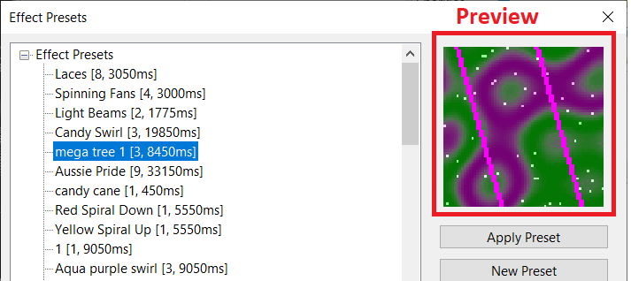

# View

## View

<figure><figcaption></figcaption></figure>

### Tool Icon Size

This function enables you to change the size of the tool icons that are used to represent the effects on the effects ribbon.

Four options are available:

.png>)

### Model Handle Size

This option will adjust the size of the model handles in the Layout Tab.

.png>)

There are three sizes available:

.png>)

.png>)

.png>)

### Effect Assist Window

.png>)

"Always On" will display the window in all cases, "Always Off" won’t display the window and "Auto Toggle" will display the window if the effect supports it, else won't display the window if the effect does not have this capability. Click on an effect in the sequencer grid and expand the Effect Assist window. If "Always on" is selected and the effect is not supported by this window, then you will see a red X in the window.

### Play Controls On Preview

This Options will display Play, Pause, Stop, Scrub Bar to the House Preview to allow control of the sequence playback. They will only appear if the house preview window is larger than 400 wide by 300 high.

.png>)

### Auto Show House Preview

Automatically Show the House Preview Window when the sequence is playing and hide the House Preview when the sequence is stopped.

### Enable Base Show Folder Settings

Enabled Options on the Controller Tab to use a **Base Show Folder**. Base Show Folder's allow models and controllers to be used across multiple Show Folders.

<figure><figcaption></figcaption></figure>

### Timeline Zooming

Zoom in on the Sequencer Timeline based on the Play Marker(Green Triangle with Red Line) Or the Mouse Curser Location

<figure><figcaption></figcaption></figure>

### Hide Preset Preview

Enable to disable the Effect Preview in the Effects Preset Dialog.

<figure><figcaption></figcaption></figure>

### Zoom to Curser

Zoom to the Mouse Curser in the layout tab or to the center of the screen if disabled.

### Disable key acceleration when held down

Disable Acceleration when Moving Models with the Keyboard Arrow Keys. This will use a constant speed over speeding up as the key is held down.

### Grid Center Crosshair Size

Size of the Red Crosshair displayed for the Group Center in the Layout Tab.

<figure><figcaption></figcaption></figure>

