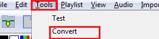

# Convert

## Convert

The Convert function is commonly used to convert a sequence file from one sequencer format to the format of another sequencer or to the format (.fseq) required to run via Falcon Player on a Raspberry Pi or BeagleBone Black controller.

It is not to be used to convert into an xLights sequence – use the Data Layer or Import, Import Effects options to achieve that.

Supported input/output formats are:

.png>)

.png>)

1.  Click on Choose Files, and on the subsequent window, change the file type to the type of file that you wish to convert and navigate to where your input file (i.e. LOR LMS file etc) is located. Select the file and Click Open or Double click to select the file.

    
2. Select the output Format to convert to. Supported output formats are:
3. Specify whether all channels should be turned off at the end of the sequence. (Tick if unsure)
4. Select the Show Verbose Channel Map.  This option will display messages pertaining to the input sequencer channel mapping  for some inputs and is useful to identify missing or misaligned channel information.
5. Select the options specific to LOR conversion.
6. Specify the time resolution i.e. (25ms, 50ms, 100ms). These correspond to (40 fps, 20 fps, and 10 fps respectively).  Select 50ms if not sure.
7. Click on Start Conversion.
8. Conversion messages are displayed. If successfully converted, a file of the same name but with a different extension (i.e. as specified for the Output Format) will be created in your show directory.

With the ‘Show Verbose Channel Map’ selected, the conversion messages display which channels have been converted to equivalent xLights channels. This information can then be used to amend the channel mapping and/or define additional LOR controllers as required.
