# Generate Custom Model

### Generate Custom Model

The Generate Custom Model function enables you to generate an xLights custom model using a picture or video of the physical item. You should have defined your controller and need to know which channel the model will start on and how many channels.

Select the Generate Custom Model option from the Tools menu.

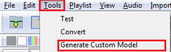

There are three type of models for which custom models can be generated:

1. A static model - such as a wireframe silhouette (reindeer or similar) where a row of lights can be turned off or on. You can use the video process described here or even use a photograph of the image.
2. Pixel based effects where each node is three channels.
3. Single Channel such as Singing faces where several LED nodes turn on and off for a single channel.


The video or photograph should be done with the model in front of a plain dark background with the lights on. There should not be too much of bright light (otherwise the bulbs as they light up cannot be clearly distinguished), neither should it be completed dark, else this will cause a scattered flash effect.


Click on the Prepare tab to generate the lights that you need to record a video for.

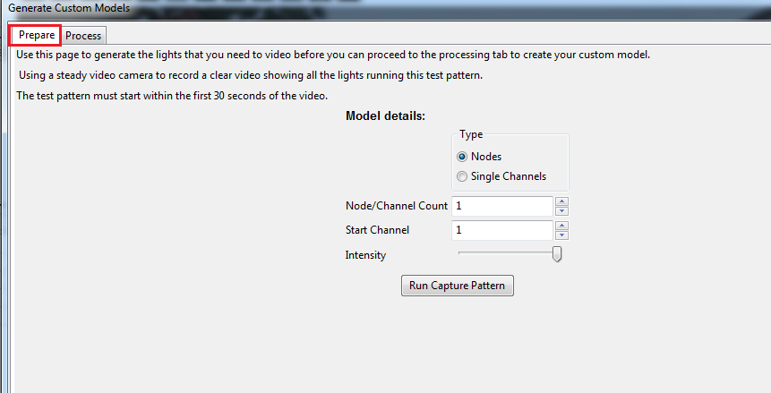

If the model is a pixel based model, select Type-Nodes. If the model is a single channel, select Type-Single Channels.

The Node/Channels counts refers to the number of Pixel nodes (Type =Nodes) or Channels (Type = channels). A face with 7 channels would have 7 specified as the Channel count.  A star with 100 nodes - would have 100 specified as the count.

#### Static Channel example

Set Type = Nodes.  The start channel corresponds to  the start channel of the model definition.

Leave the intensity bar setting in the position that it has defaulted to.

Click on the Run Capture Program.  The following prompt will be displayed.

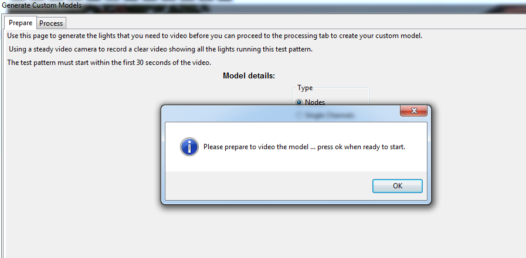

When your camera is ready, steady and in position, click on OK. The software will flash the lights twice, then run through the model definition, lighting each bulb in turn. When complete the following message will be displayed to stop the video recording. The recording has now been completed.

Upload/Copy the video from the camera onto your PC directory.

Click on the Process tab. Select the Type of  lights and press Next.

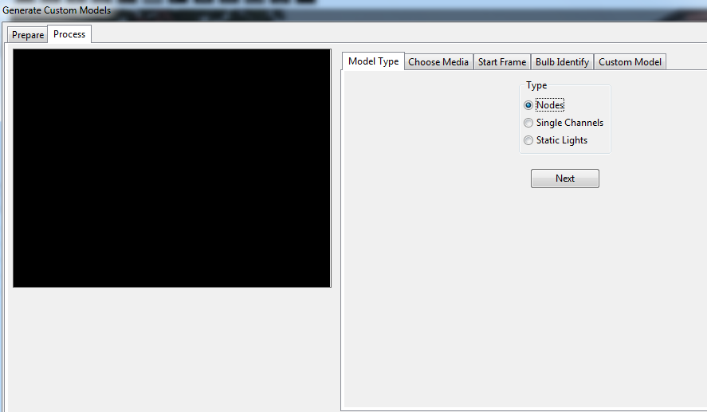

When prompted for the location of the video file, browse to and select the video file that was recorded in the earlier Prepare step. Then click on Next.

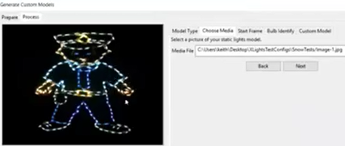

The red dots are the lights that have been found and retained. The blue dots are the lights that have been found , but have been discarded because they are too close to a red dot. If the dots are too close, then the model generated becomes too big.

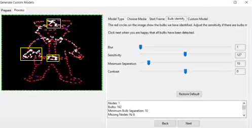

There are three areas in the image where the lights have not been detected (the yellow boxes have been added for illustration in  the manual only ). Increase the sensitivity (move slider to the right). The window at the bottom of the screen indicates how many nodes have been detected, the number of bulbs detected, how many nodes are missing, which nodes have more than one bulb and the size of the model.

Click Next and the model that is generated is displayed.

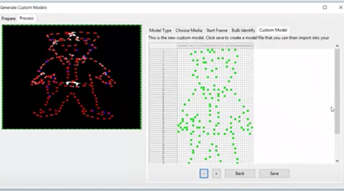


Use the ‘-’ and ‘+’ keys to zoom out and zoom in to see the model.


Click on Save to name and save the custom model.

Then use the Import Custom model  function on the Layout screen to import the model that has just been created.

#### Pixel Node example

Select Type = Nodes and repeat the same process as described under the Static Lights example (Prepare).

Similarly, when your camera is ready, steady and in position, click on OK. The software will flash the lights twice, then run through the model definition, lighting each bulb in turn. When complete a message will be displayed to stop the video recording.

Then using the Process screen, browse to and select the video that has been generated and uploaded to your PC.

Click on Next.

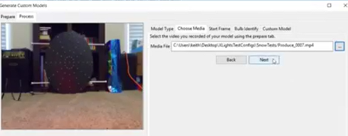

The software will examine the first fifteen seconds on the video to identify the start point (ie when the first of two flashes occurred and will then check that it can determine the pathway of the lights). A ‘Looks ok’ message will be displayed along with the start position on the video (2.95 secs in the example) if this is detected. If it does not work ( a ‘Looks wrong’ message will be displayed) , or the start position does does not look right , you can use the four frame buttons to move the video back or forward.

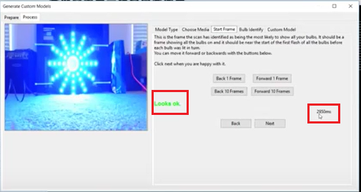

Click on Next to proceed to the next step. You can adjust the controls if required. The blur can be used (increased) to remove any dead spots, the sensitivity adjusted (right if some bulbs are not detected and left if too many are detected).

If the ‘Video is steady’ is selected, then the software will attempt to filter out some of the background to get a better image. Otherwise it will retain much of the background and try and compensate of an unsteady video camera , but this may generate additional pixels.

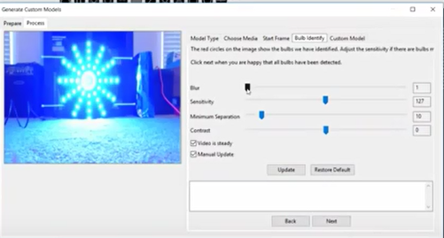

If Manual update is selected, then moving the sliders won’t do anything unless the Update button in then pressed.  The Restore Default button is used to restore the sliders and options to the default option.

The image shows the pixels generated (red dots). The  two yellow boxes (that have been added in the manual only) illustrates spurious pixels. &#x20;

The window displays the number of nodes, how many bulbs were detected, missing nodes and a list of nodes where more than one bulb has been detected. You want the number of bulbs to match the number of nodes or be as close to it as possible.

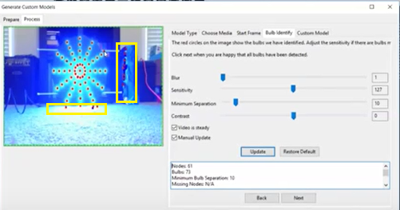

Use the Trim bars (i.e. drag them towards the image) to eliminate the pixels around the image. The number of bulbs should decrease as this occurs. Increasing the sensitivity  can also be used to try and filter out others nodes.

Click Next and the model that is generated is displayed.

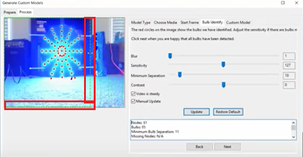


Use the ‘-’ and ‘+’ keys to zoom out and zoom in to see the model.


Click on Save to name and save the custom model.

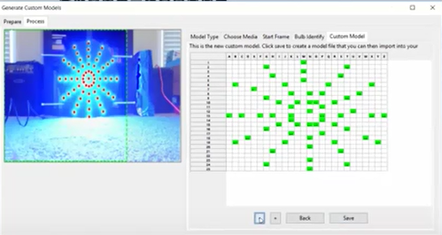

Then use the Import Custom model  function on the Layout screen to import the model that has just been created.
