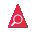
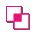
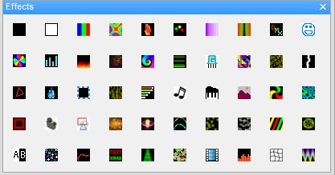

# Windows

## Windows

There are a number of windows that enable simultaneous display of different views in xLights. When xLights first loads, a default set of windows are displayed. Which windows are open can be controlled via the Windows menu by selecting View, Windows and then clicking on the required window to open it. The window is dropped by default on the left side of the screen, however each window can be moved and docked to alternate locations on the same screen or moved to an alternate display screen if connected to your PC/ MAC.

 (1).png>)

.png>)

###  Display Elements

The Display Elements window enables views, Timings as well as models to be defined and updated. Functionality for these functions is described in the Views, Timings and Models section of this document.

 (1).png>)


[views.md](../../chapter-four-sequencer/views.md)


###  Model Preview

The Model Preview window displays the effects on a model as the sequence is playing. With the window open, right click on the model name when on the sequencer tab and select Play model. It can also be opened/closed by clicking on the icon on the toolbar.

.png>)

###  House Preview

The House Preview window displays the effects of your entire display where the model or model group has been assigned to the currently selected Preview window. Refer to explanations of multiple Preview windows in the Layout section. It can also be opened/closed by clicking on the icon on the toolbar.

.png>)

###  Effect Settings

The Effect Settings window displays the current or last effect that is being worked with. If an effect on the grid is selected or a new effect dragged to the grid, then this window gets updated with the ‘current’ effect.

.png>)

Use the window to modify the attributes of the effect as required. The results of the change are displayed in the model window when selected and in the House Preview window when the sequence is played.

The Value Curves functionality in this window has been covered under a separate topic entitled Value Curves.


It is possible to select a group of the same effects and change the settings of all of them all at once. For example you wish to increase 5 instances of the Circle effect to have the Number of Circles = 10. Select multiple instances of the effect by holding down control when you click on them. Change the Number of Circles setting to 10 , then click on the Update (F5) button in the Effect Settings window. The window can also be opened/closed by clicking on the icon in the toolbar.


###  Color

The Effect Colors window enables the user to change the colors of the current effect that is being worked with. If an effect on the grid is selected or a new effect dragged to the grid, then this window uses the ‘current’ color.

 (1).png>)

Use the window to modify the colors of the effect as required. The results of the change are displayed in the model window when selected and in the House Preview window when the sequence is played.

The Value Curves functionality in this window has been covered under a separate topic entitled Value Curves


It is possible to select a group of the same effect type and change the color of all of them all at once. For example 5, spiral effects that are all on different models and need to be changed to the same color. Select multiple effects by holding down control when you click on them. Change the color palette then hit the Update button beside the colors. The window can also be opened/closed by clicking on the icon in the toolbar.


By clicking on one of the colors, the color box will appear allowing you to choose or create any color you desire. To create a custom color, click on the Define Custom Colors >> button.


[changing-color-settings.md](../../chapter-four-sequencer/changing-an-effect/changing-color-settings.md)


###  Layer Blending

The first option of Morph is used with two or more layers. If selected, effect #1 will morph/blend/fade into Effect #2 midway through the timing interval in which the effects are placed.

.png>)


[layer-blending.md](../../chapter-four-sequencer/layers/layer-blending.md)


###  Layer Settings

The Layer Settings menu has two tabs. The first tab (Buffer) defines how the effect will be adjusted during the render process in the buffer for the Model or Model Group. The second tab (Roto-Zoom) is used to apply the Roto-Zoom functionality to the model effect.



.png>)



.png>)




[layer-settings.md](../../chapter-four-sequencer/layers/layer-settings.md)


###  Effect Dropper

The Effects Dropper window displays all the supported effects and enables you to select a required effect and drag it to the sequence grid.

The same functionality can also be obtained using the effects from the effects toolbar as below:


The size on the icons on the Effects Toolbar can be adjusted by going to _Settings/Tool Icon Size._ There are 4 different sized icons are available for use.


### Value Curves

The Value Curves Dialog allows the user to drag and drop their saved values curves onto the desired effect setting.

.png>)

### Color Dropper

The Color Dropper Dialog allows the user to drag and drop their saved colors/color curves onto the color palette.

.png>)

### Effect Assist

The Effect Assist Window is an additional window that helps you determine how an effects is being drawn via a panel view.

.png>)

For example, if you open this window against a morph effect, the windows will display a grid corresponding to the x,y coordinates. If you then grab a slider for the morph effect and move it, the Effect Assist window shows exactly where the coordinate is being moved to, making it easier to determine what is being done to the effect.

You can also grab a corner of the image in the Effect Assist window and move it and have the slider values update in real time.

If you want single line morphs instead of area morphs then it's easier to just click with the left mouse button to establish the start points and click with the right mouse button to establish the endpoints. For areas you can either click and drag with either button or drag the handles.

### Select Effect

The Select Effects Window allows the user to select effects based on type, model, and time. Based on the these selection, multiple effects can be selected and then bulk edit can be used to adjust the settings. This allows the user to, for example, select all the pinwheel effects on there mini trees and change the number of arms with bulk edit.

.png>)

The "Effect Type" allows the user to select which effect type to select.  The Model List allows the user to select which models to filter selection on. Only highlighted model names, will have their effects selected. The Time Fields allows the user to effect filter selection by time. The Effects by Time List displays all the effects found based on the other options and will select the highlighted items.

### Video Preview

The Video Preview Window allows the user to preview the video file, they are using while sequencing it as the audio track.

 (2).png>)

### Jukebox

The Jukebox Window allows the user to "link" an effect or multiple effects to one of it's 50 buttons. These buttons can then be used for realtime playback i.e in a DJ or theater environment. This mapping can also be used by xFade.

 (1).png>)

## Perspectives

The Perspectives Window enables you to save your current window positions and retrieve and use them later.


[perspective-definition.md](perspective-definition.md)


## Reset To Default

The Reset Toolbar option, when selected will reset the Windows and Toolbars to the default locations.This option should be used if you are missing an window or toolbar from the sequence window.
