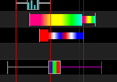
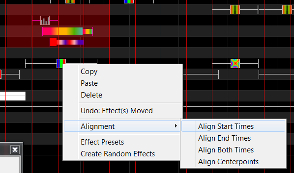
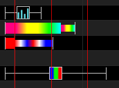
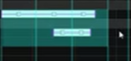
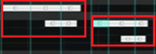
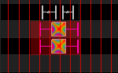
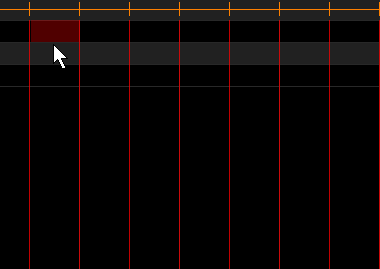

# Changing An Effect

## Changing an Effect

### Changing Effect Setting

To change an Effects setting, Select the effect in the sequencer timeline and open the Effects setting window using the shortcut in the top toolbar.

.png>)

.png>)

Each effect type has specific settings that can be used to manipulate the effect. These setting are specific to the currently selected effects. If multiple effect are selected the Effects setting panel will display the setting of the first effect. The "Update" button will change the settings of **all** the selected effects to current values used in the Effect Setting Dialog. To updated individual setting across multiple effects use the Bulk Edit option described below.

See the Effects Section for more information on the individual effect settings.


[off](../../../effects/off/)


### Changing Color Settings

From the Color window, you can change the Colors that apply to the effect, as well as the Sparkles, Brightness and Contrast values. How effects use the colors is defined by the effect.

.png>)


[changing-color-settings.md](changing-color-settings.md)


### Moving and Stretching effects

A single effect can be moved about on the sequencer horizontally , by selecting it with the mouse and dragging it left or right. A timing grid must be active. You can also select the effect and use the Left or Right arrow keys to move it left or right. When the effect encounters or is blocked by another effect, if you keep going, it will jump over the effect/effects and continue past.

Similarly an effect can also be moved vertically from one model to another. Use the Up or Down arrow keys to move it up or down. When the effect encounters or is blocked by another effect, if you keep going, it will jump over the effect/effects and continue past.

An effect or group of effects can be moved, by highlighting the effect, or range and moving it along the same model row/rows on the grid forwards or backwards. Hold the Shift key to move multiple effects.

Multiple effects can also be moved by using the Ctrl key. Click on the first effect , then hold down the Ctrl key and click on other effects. Then use the arrow keys (Up , Down , Left , Right) to move the selected effects together in the required direction.


Effects can be stretched by using the Alt key and dragging one edge of the effect highlighted (most commonly the bottom right corner) to provide a Chase effect. You may need to use Toggle Nodes to view the nodes so as to be able to stretch an effect.



A simple way to do a chase effect is to select a block of cells and hit 'd' for a fade down or 'u' for a fade up. If you then need to adjust it, drag the end line.



On OSX use Cmd key instead of Ctrl key.


### Aligning effects

In order to align several effects to the same start or end times , drag a box around all the effects you want to align and then hold down shift and click the effect you want to be the reference. Then right click and select Alignment. You can then select one of the four options to align to the effect you selected as your reference. In the example below, the Start times of three effects have been aligned to the Start of the Bar effect just below them.

You can even select a timing effect as the reference and it will align to that timing effect.

### Copy, Paste, Delete Effects

In order to copy and paste an effect, select the individual effect, right click and then select Copy. Move the cursor to where you want the effect to be copied to, right click and select Paste. You can also press Ctrl+C and Ctrl+V to copy and paste the effect.

In order to copy and paste a range of effects, use the cursor to highlight and select a range of cells. Then copy, followed by paste.

You can paste what is in the buffer (after a Copy) to multiple locations, by moving the cursor to each new location and pasting the copied data (right click and Paste or Ctrl+V) there.

.png>)

There are two modes for Copying and Pasting effects: Paste by Time or Paste by Cell.

You can select, or change the mode by clicking on one of the two icons.

Paste by Time is the most common option. You do not need to have a timing track active . You copy the required section and paste at the required location. The copy works on copying effects and not copying grid locations. Therefore it will copy the first effect from with the range highlighted, and accordingly will paste that effect (and others after it that were selected) at the grid location when Paste is selected.

Paste by Cell works using timing tracks. A timing track must be active when you copy, so that the cells to be copied can be determined from the active timing track. You can use this option to copy timings/timing data (such as the phonemes used for singing faces).

You can use this option to paste effects to cells of a different size to the cells you copied from. If the source cell was a full cell, then the target cells will be filled. If the source cell was ½ filled, then the target cell will also be ½ filled ie it will be pasted to the same proportion as the source cell. 

Examples

1. You copy a single effect, select a target cell and hit Paste with Paste by Time mode.  The result is the effect is pasted with the original duration. So if the original duration was  2 seconds , then two seconds duration will be pasted in the target irrespective of the length of the cells..
2. You copy a single effect, select a target cell and hit Paste with Paste by Cell mode.  The result is the effect is pasted to fit within the target selected cell based on a %.

If it was 100% of the source cell, then the full target cell will be covered.

If it was 50% of the source cell, then 50% of the target will be selected.

You can delete an effect, by selecting the effect in the grid and pressing delete on your keyboard or pressing Ctrl+X.


In order to delete multiple effects, use the left mouse key to highlight a range of cells and then press delete. You can also right click on an effect and choose delete.


## Right Click Options

### Model - Copy

You can copy the effects of an entire model/group and paste it to another model/group.

Highlight the model name, right click and select Model, Copy Effects to copy the entire row of the effects.

.png>)

.png>)

### Model - Paste

Then select the model name header you want to paste the effects (in the same sequence or another sequence), right click against the model name and select Model -> Paste Effects. The data copied remains in the clipboard buffer. The Paste operation does not have to be immediately after the Copy operation.

.png>)

### Row - Copy

You can copy the effects of an entire row/layer and paste it to another row/layer.

Highlight the row/layer header, right click and select Row, Copy Effects to copy the entire row of the effects.

.png>)

### Row - Paste

You then paste the effects from the entire row/layer by right clicking on the row header and selecting Row, Paste Effects

.png>)

### Undo Effect

Many, but not all effect actions can be ‘Undone’ by right clicking on the Grid and selecting the Undo action i.e. Undo effect move or Undo delete.. etc

You can also use the shortcut key of Ctrl+Z. The Undo actions can be daisy changed i.e. they can be repeated one after another.

### Selecting Multiple Effects

In order to select a group of effects, use the left mouse key to select the range of effects. The color of the cells change, but also, the links in the selected cells will turn to magenta.

You can only select a group of cells, when the cursor looks like a pointing hand.

If two arrows are shown, then you can’t select the cells. You may need to zoom in to be able to see and select the required effects.

### Bulk Edit

After selecting multiple effects, the user can change an individual setting across all the selecting effects. Right Click on the effects setting to change and select Bulk Edit.

.png>)

A separate window will appear, allowing the user to change the setting.

.png>)

After Clicking OK, all the selected effects will be changed to the new setting value.


If effects of different types are selected Bulk Edit will only change the setting of the Effect Type displayed in the Effects Settings Window.


### Create Random Effects

Select and highlight an area on the effects grid. Right click and select the "Create Random effects" option. Effects will be randomly selected (along with different colors and options) and created in the area highlighted, each between consecutive timing marks. If no timing marks are active, then a default time length will be used for each effect. Use the shortcut key ‘R’ to achieve the same result by highlighting one or more cells and pressing 'R' on the keyboard. The Effects used by Create Random Effects can be set in the File->Preferences Menu under the "Random Effects" Tab.

