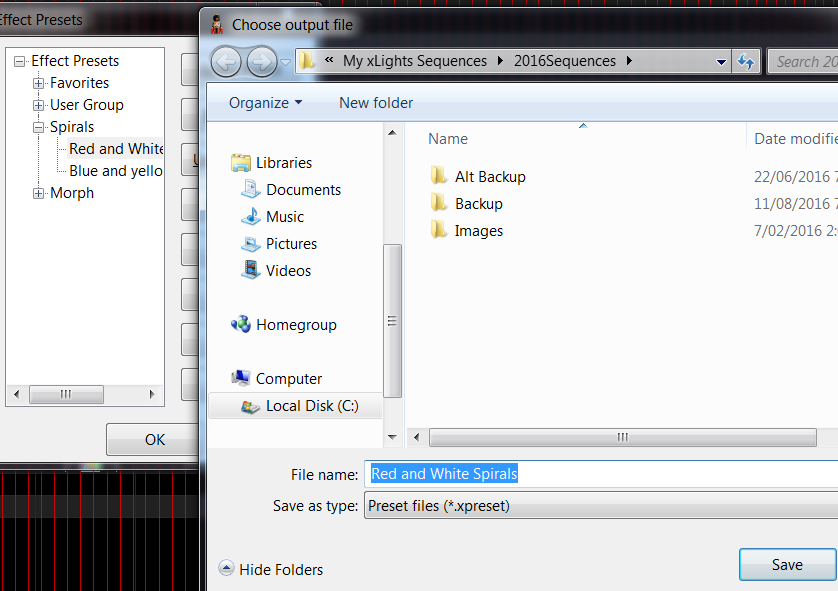

# Effect Presets

## Effect Presets

Presets are a way to save an effect and easily recall it later to speed up sequencing.

.png>)

You can also send snippets of your effects to other people and import and use snippets of effects supplied by other people without having to import an entire model.

The Effect Presets window enables presets to be managed. You can group them and perform a number of actions.

Against each preset name, the count of the number of effect layers is displayed.

.png>)

### New Preset

To save an effect (which can span layers and models) as a preset, highlight the effects that you want to save, right click and select Effect Presets.  Under the Favorites tree, you can first create a group that describes the type of effect that you are going to save (Spirals, Bars, etc). Click on Add group and give the group a name (‘Spirals’).  Then select the group and click New Preset and give the Preset name (‘Red and White Spirals’) and press OK

### Retrieve Preset / Apply Preset

To retrieve a preset that has been saved, go to a location on the grid where you wish the preset to be placed, right click on the sequencing grid, select Effects Preset, scroll to and locate the preset you want and double click on it to have it copied to your location, or select Apply Effect.

### Updating a Preset

If you change something within an effect preset that you have selected, you can update it by clicking Update Preset.

### Export Preset

To export a preset , select the Preset name from the list in the Preset panel, then click on Export preset. Specify a name and click on Save. A file with the selected name and a ‘.xpreset’ suffix  will be created.

### Import Presets

To import a preset, click on Import Preset, browse to where the  ‘.xpreset’ file is located, select it and then then click on Open. A preset will be created under the highlighted  group with the name of the selected file.

### Maintaining Presets

You can move an effect preset from one group to another group by dragging it across from one group to another. You can also highlight the name and delete it or rename it.
