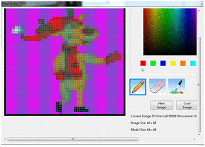
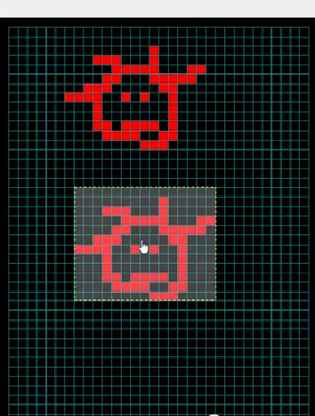

# Pixel Editor

## **Pixel Editor (Matrix Drawing Tool)**

You can use the Matrix drawing tools to amend a picture or draw your own pictures or animations.  Click on the Picture effect within the sequence grid that contains your effect and then open the Effect Assist window if it is not already open. You will be presented with a window similar to the following i.e. the picture of your effect is copied to a grid.

The Matrix Drawing Tool has 8 windows, each with a color and a radio button under the color to show you which color is selected. You can change the color assigned to each window, change the saturation, hue, brightness, change the RGB setting etc.

Select the pencil tool and after selecting a color, use the left mouse button to draw and fill in the selected color or use the right mouse button to erase what has been drawn.  The eraser can be used to remove colors on the grid.

### New Image

Click on New Image to create a new image.  The first time you use this function, you will be prompted for a directory to store the image files in. As an example, create an ‘image’ subdirectory within your show directory.

You will be presented with an empty grid and you can then draw/paint your effect within the grid.  Click on Save image and name the image. The model window will display the model just drawn. (The model won’t be updated until the file is saved).

### &#x20;Load Image

Load Image is used to load a previously saved image or any other supported image.  If the picture loaded is not as per the model scale, you won’t be able to edit it.

### Save As

Save As can be used to save an effect to a new name.

### Copy / Paste

Highlight the area that you wish to copy, press Ctrl C to copy to the clipboard buffer, move to the area that you wish and press Ctrl V to paste it.

