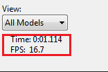
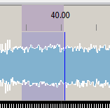

# Timeline and Waveform

## Timeline and Waveform

The top section of the display window is the Timeline section and indicates the scale that the waveform and sequencer is displaying.

You can select an area on the timeline – depicted by the arrows - and you can then play that section once independent of the section highlighted to be played on the waveform. At the end of playing that section, the highlighted arrows disappear, leaving the waveform highlight to be played. Clicking anywhere in the timeline or highlighting an area in the timeline initiates auto play, without losing the waveform selection.

.png>)

The waveform displays a sonographic representation of the audio portion of the media that has been associated with the sequence.

.png>)

### Zoom in and Zoom out

You can control the focus of the waveform.

.png>)

* Zoom in on the waveform by double clicking on the waveform. Keep double clicking until you've got a zoom setting you can use. Or click on the ‘+’ button.
* To zoom out, hold the shift key and double click on the waveform or click on the ‘-‘- button.
* Click the edge of an effect, hold down control and use the mouse scroll wheel to go in or out.

.png>)

### Scroll Left/Right

Click on the waveform. Then hold down the Shift key and use the scroll key of the mouse to move the waveform and grid left or right.

.png>)

When playing the sequence, a vertical line indicates the start position and another vertical line extending right through the grid indicates where the audio being played current is

The time counter displays the time from the beginning of the sequence that the current position is up to. The FPS value displays the Frames Per Second that the sequence is outputting the data at.

You can highlight a range on the waveform to play only that section. If you move your cursor on the waveform towards either edge of the highlighted area, a ‘hand’ appears and you can use that to move the edge.

* If the Pause button  is selected, and then pressed again, the sequence will restart from the current position that it stopped at.
* If after a Pause, if the Play button is pressed, then the sequence will restart from the marked ‘start position’.
* Clicking on the Stop button will reset the start position to the beginning of the sequence.
* After Stop has been pressed the Rewind button will start from the beginning of the sequence and the fast forward button will play from the last component of the sequence.
* Highlighting a portion of the waveform will cause only that section to be played. Pressing the spacebar will replay that section.
* The ‘Replay’ button  will replay the highlighted section of the waveform. It will start from the beginning of the highlighted area and when it reaches the end of the area , will loop back to play from the beginning of that area. &#x20;

.png>)

Clicking on an effect in the grid will not alter the waveform area that has been highlighted to be played. The effect becomes the focus point, if you zoom in and out, but the play range does not change. If you do want the start position to move to where your effect is, or to be based on the edit position in the grid, then double click in the grid and that will then remove any highlighted position/area in the waveform and set the start position in line with where you have double clicked.

To scroll Left/ Right, click in the grid. Then hold down the Shift key and use the scroll key of the mouse to move the grid left or right.

### Audio Scrubbing

Hold the Ctrl key down and placing the mouse on the waveform, click and hold the mouse left button down and and drag it across the waveform.

The audio will be played as you scrub the line. Therefore you can play a small section again and again, backwards and forwards so as to identify a particular note inflection, timing mark or a word of a lyric.

### Timeline Tags

.png>)

Timeline Tags allow the user to create "bookmarks" or "shortcuts" on timeline numbered 0-9. You can then type CTRL + 0-9 to scroll the timeline to the numbered tag's location. To add a timeline tag right-click on the timeline at the desired timing location and select a number 0-9. Numbers with check-marks already have tags placed on the timeline. You can reuse a tag with a check-mark but the previous location will be overwritten.

.png>)

To delete a timeline tag Right Click on the timeline and Select Delete and then the number of the tag you want to remove.

.png>)
