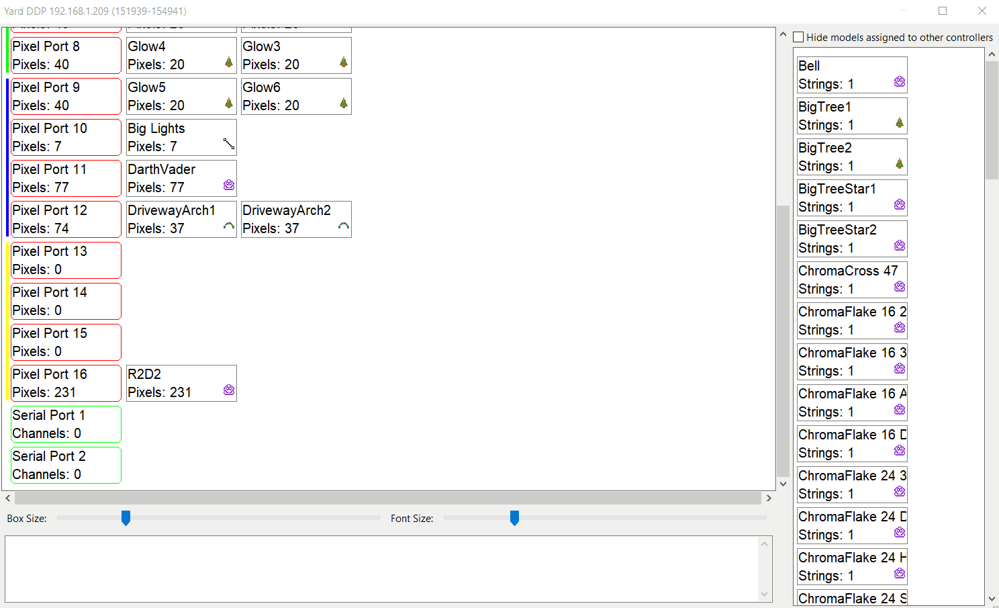
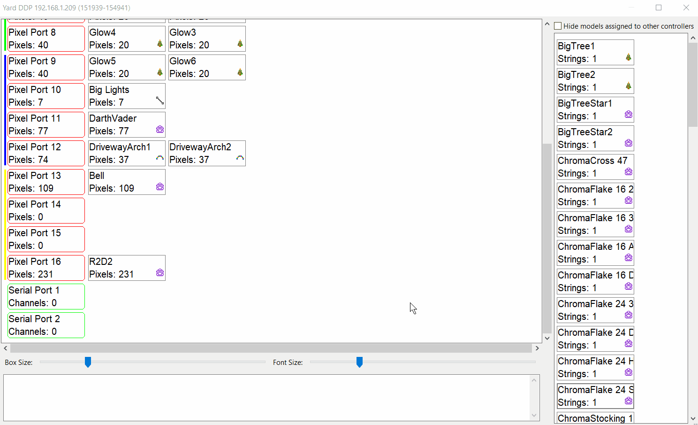

# Controller Visualizer

## Controller Visualizer

.png>)

The Controller Visualizer allows the user to drag and drop models onto the controller ports. All model setting are update and saved in real time. If the "Auto Layout Models" option is disabled for the controller, this dialog will only let the user view the model port connections set in the layout tab.

Hover over a model to display its current settings.

.png>)

### Size Adjustment Sliders

.png>)

The Box Size and Font Size sliders will change the size of the drag and drop boxes and font size.

### Status Message Box

The Status Message Box will display errors that are found in the current controller configuration. If an error is displayed, xLights will not upload the controller configuration.

.png>)

### Adding/Moving Models

To add a model, Drag a model from the right model list to the desired controller port on the left.


If adding a model to a controller port and the wrong number of ports are used, adjust the model string count in the Layout Tab.


### Removing Model

To remove a model, drag a it from the controller port list on the right to the model list on the left.

## Model Right Click Menu

.png>)

### Print

Prints the controller model layout of the Visualizer Screen.&#x20;

### Save As CSV

Saves controller model layout to a CSV file for editing.

### Remove all models from controller

Removal all the models from all the controller ports.

### None/A->B->C

Set the smart receiver for Falcon Controllers.

.png>)

| Smart Receiver Setting | Outputs Used              |
| ---------------------- | ------------------------- |
| \*A\*                  | "A' Receiver Outputs Only |
| \*B\*                  | 'B' Receiver Outputs Only |
| \*C\*                  | 'C' Receiver Outputs Only |
| \*A\*->\*B\*->\*C\*    | 'A', 'B', & 'C' Outputs   |
| \*B\*->\*C\*           | 'B', & 'C' Outputs        |

Smart Receivers will display as different colors if set. Green is 'A', Purple is 'B', and Orange is 'C'

.png>)

### Set Brightness

Set the Model Brightness.

.png>)

### Clear Brightness

Clear the Model Brightness.

.png>)

## Controller Port Right Click Menu

.png>)

### Set Protocol

Set the Controller Port Protocol.

.png>)

### Remove all models from port

Removal all the models from the selected controller port.

### Move all models to port

Move all models from the currently selected port to another port.

