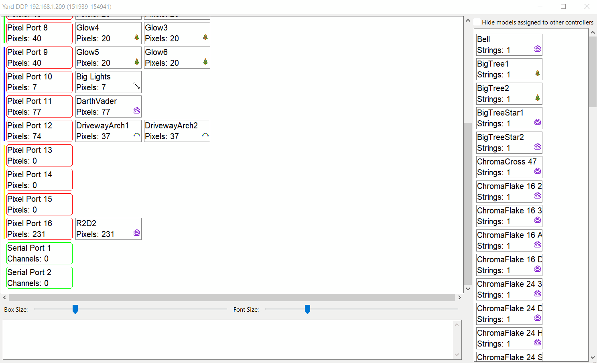
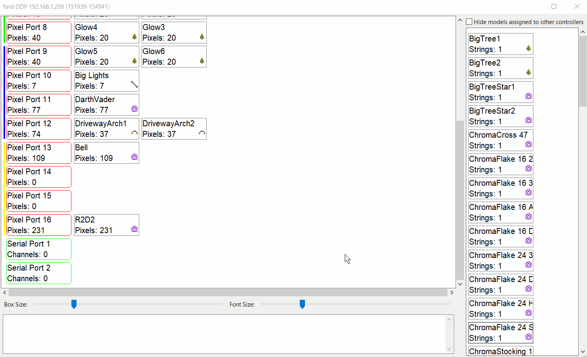

# Controller Visualizer

## Controller Visualizer

.png>)

The Controller Visualizer allows the user to drag and drop models onto the controller ports. All model setting are update and saved in real time. If the "Auto Layout Models" option is disabled for the controller, this dialog will only allow the user view the model port connections set in the layout tab.

Hover over a model to display its current settings.

.png>)

### Model Search

A search box at the top of the model list lets you quickly jump to a model by name. Start typing part of a model name to filter or locate the matching model, which is useful when a show has a large number of models.

<!-- TODO: screenshot -->

### Base Show Folder Models

Model boxes for models that come from the base show folder display a link icon. This indicates the model is shared from the base show folder rather than defined directly in the current show folder.

<!-- TODO: screenshot -->

### Size Adjustment Sliders

.png>)

The Box Size and Font Size sliders will change the size of the drag and drop boxes and font size.

### Status Message Box

The Status Message Box will display errors that are found in the current controller configuration. If an error is displayed, xLights will not upload the controller configuration.

.png>)

### Adding/Moving Models

To add a model, Drag a model from the right model list to the desired controller port on the left.


If adding a model to a controller port and the wrong number of ports are used, adjust the model string count in the Layout Tab.


### Removing Model

To remove a model, drag a it from the controller port list on the right to the model list on the left.

## Model Right Click Menu

### Print

Prints the controller model layout of the Visualizer Screen.&#x20;

### Save As CSV

Saves controller model layout to a CSV file for editing.

### Remove all models from controller

Removal all the models from all the controller ports.

### Change String Count

Change the physical number of strings i.e controller ports a model consumes. When used, xLights will attempt to adjust the Nodes Per String and Stands per String to preserve the original total pixel count of the model. Only works with Tree/Matrix/Custom Models.

### Smart Remotes

.png>)

#### None/A/B/C/D/E/F

Set the Smart Receiver ID for Falcon/Kulp/FPP/HinksPix Controllers. None is used for "Dumb" or normal receivers.

#### Type

Set the Type of Smart Receiver. V1 "White" Receivers are "falconv1", "Blue" or "Black" Receivers are "falconv2" or "fppv2".

.png>)

For controllers that require all ports in a port block to use the same smart receiver type, changing the type on one port automatically syncs that type across the rest of the port block, so the ports stay consistent.

#### Cascade Down Port

When enable, this will change the string order to proceed down the daisy chained receivers on the current "chain" of remotes. This is needed for controllers that don't support 'Virtual Strings' like the HinksPix Pro.

#### Cascade Remotes

This allow multi-string models to use multiple smart receivers daisy chained together. When Cascade Remotes is set to 4, xLights will assign strings to 4 smart receivers chained together.

.png>)

#### Smart Receiver Color

Smart Receivers will display as different colors if set. Green is 'A', Purple is 'B', Orange is 'C', and Light Blue is 'D'. The colors will repeat after 'D', Green is 'E', etc.

.png>)

### Set Brightness

Set the Model Brightness.

.png>)

### Clear Brightness

Clear the Model Brightness.

.png>)

## Controller Port Right Click Menu

.png>)

### Set Protocol

Set the Controller Port Protocol.

.png>)

On KulpLights controllers that have two serial ports, each serial port can be set to its own protocol independently, so the two ports do not have to share the same serial protocol.

### Remove all models from port

Removal all the models from the selected controller port.

### Move all models to port

Move all models from the currently selected port to another port.

