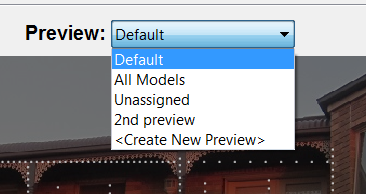
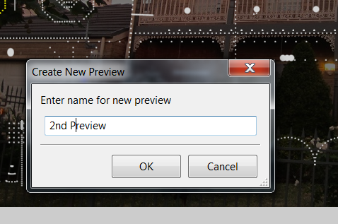
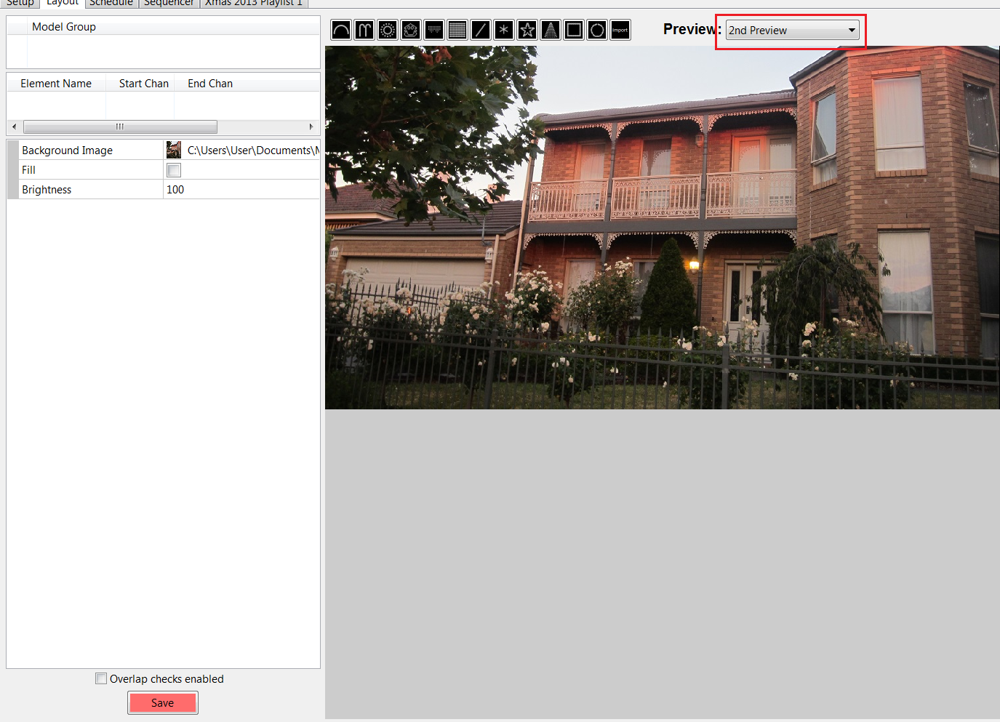
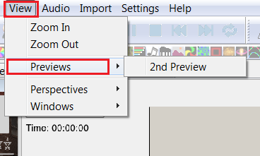

# Editing Layout Preview

## Editing **Preview Layouts**

The Preview Window displays the available preview windows, enables you to select a different view and also enables you to create additional Preview Layout windows. To create a new Preview Layout, select the \<Create New Preview> option from the window.


When would you create an additional Preview layout? If you had a corner block and you wanted to sequence from 2 directions or if you have a really wide block you can split it so everything does not become small, or if you are sequencing multiple houses in your street.


Enter the name for the Preview Layout and click Ok.

The new preview window will be created and the image that has been used for the default Preview will be selected.

Click on the Background Image attributes to browse for and select a different image if required. Otherwise, adjust the fill attribute value and the brightness value.

The image size has to be the same as the default image and as such, it is not available to change. Click on the Save button to save it.

The preview window can now be used to create Models or Model Groups against similar to the Default Preview layout. Models can be reassigned to the different Preview by changing the "Preview" Model Setting.

.png>)

If you wish to delete the preview , right click within the window and click on the ‘Delete this Preview’ option.

When a Preview is Deleted, All the Models currently assigned to it will become unassigned and need to be reassigned to another preview.

 (1).png>)

When an additional Preview is created, a ‘Previews’ option to select and open it on your sequencer will be available on the View menu. Click on the preview name to open the Preview window. This option is not available if only the Default preview exists.

