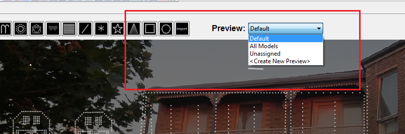
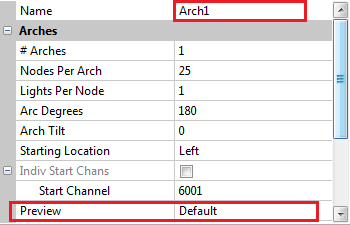
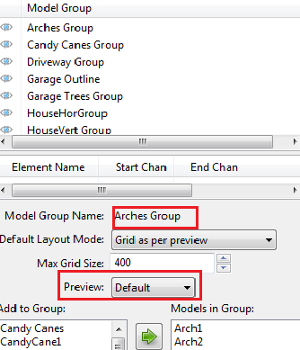

# Layout Preview

## **Layout Previews**

You can select which models you wish to see on your Layout Preview.  This is done by first selecting the Preview that you want to be active from the Preview selection window.

There are three built in preview options: ‘Default’, ‘All Models’ and ‘Unassigned’. You also have the ability to create new preview windows.

### Default

If you only plan on having one preview, which is what most people will have, then this is the one to use.

Select the default ‘Default’ preview which will then display the models where either:

* The Preview attribute against the model definition has been set to ‘Default’.
* The Model is part of a Model Group where the Preview attribute has been set to ‘Default’.

