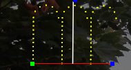

# Candy Cane Model

## **Candy Cane model**

The ‘# Canes’ value can be set to the number of canes that the model represents (normally one).  Similarly you can set the nodes per cane and lights per node (normally 1). The angle of the cane can be adjusted by changing the Cane Rotation value, or grab and move the top of the cane clockwise or anti clockwise.

Select the Reverse attribute to set the the crock of the cane facing the opposite direction.  Select the Sticks attribute to set the cane to be a straight line without the curved crock.

In this example, a Candy Cane model has three canes in one set. Each cane has 18 nodes in it.

.png>)

The start channel address is 1 and it is has  RGB pixel nodes so it will use 54 channels.

Alternate Nodes will skip every other hole to allow wiring up and down each candy cane and prevent wire splicing.
