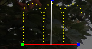

# Candy Cane Model

## **Candy Cane model**

The ‘# Canes’ value can be set to the number of canes that the model represents (normally one).  Similarly you can set the nodes per cane and lights per node (normally 1). The angle of the cane can be adjusted by changing the Cane Rotation value, or grab and move the top of the cane clockwise or anti clockwise.

Select the Reverse attribute to set the the crock of the cane facing the opposite direction.  Select the Sticks attribute to set the cane to be a straight line without the curved crock.

In this example, a Candy Cane model has three canes in one set. Each cane has 18 nodes in it.

.png>)

The start channel address is 1 and it is has  RGB pixel nodes so it will use 54 channels.

Alternate Nodes will skip every other hole to allow wiring up and down each candy cane and prevent wire splicing.

## Model Settings

<!-- TODO: screenshot -->

| **Options/Setting** | **Description** |
| --- | --- |
| **# Canes** | Number of canes the model represents (normally one). Range 1-20. |
| **Nodes Per Cane** | Number of nodes in each cane. Range 1-250. Shown as **Lights Per Cane** when the model is a single-node (channel) type. |
| **Lights Per Node** | Number of individual lights/LEDs per node. Range 1-250. Hidden for single-node string types. |
| **Height** | Height of the cane. Floating-point value adjustable in steps of 0.1. |
| **Cane Rotation** | Rotates the cane clockwise or anti-clockwise. Range -180 to 180. Can also be set by grabbing and moving the top of the cane. |
| **Reverse** | Sets the crook of the cane to face the opposite direction. Disabled when **Sticks** is enabled. |
| **Sticks** | Makes the cane a straight line without the curved crook. |
| **Alternate Nodes** | Skips every other hole so wiring can run up and down each cane without splicing. Disabled for single-node string types. |
| **Starting Location** | Sets the side where the wiring starts (Green Square / Blue Square). |
