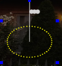
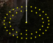

# Circle Model

## **Circle model**

### # of Strings

The # of Strings corresponds to the physical number of strings for that mode&#x6C;**.** This should match the number of controller ports you plan to use.&#x20;

### Nodes/String or Lights/String

The Nodes per String or Lights per String represents the physical number of light nodes, bulbs or pixels in each string. If the # of Strings is set to 2 and the Nodes per String is 100, the model will contain 200 total nodes.

### Center %

The Center % is used to indicate how much area the empty area of the circle occupies. Decreasing it will drop the circles inwards and increasing it will push the circles outwards.

### Layers

The Layers attribute value describe the concentric rings in the circle. This will create node count settings for each layer. The sum of the node counts must add up to the number of nodes in the model.

.png>)

### Starting Location

The default starting pixel is at the bottom of the circle, go clockwise on the outside ring and then the next inner ring wired and so on. The Starting Location can be changed to start at the top of circle, or start on the inter ring or run counterclockwise if needed.

.png>)

## Model Settings

<!-- TODO: screenshot -->

| **Options/Setting** | **Description** |
| --- | --- |
| **Center %** | How much of the circle is taken up by the empty center area (0-100). Decreasing it pulls the rings inward; increasing it pushes them outward. |
| **Layers** | The number of concentric rings in the circle (1-100). When more than one layer is set, a node count is exposed for each layer (the innermost is labelled **Inside**, the outermost **Outside**, the rest **Layer 2**, **Layer 3**, etc., each 1-1000). The layer node counts must add up to the total number of nodes in the model. |
| **Starting Location** | Where wiring begins and which way it runs. Choices: **Top Outer-CCW**, **Top Outer-CW**, **Top Inner-CCW**, **Top Inner-CW**, **Bottom Outer-CCW**, **Bottom Outer-CW**, **Bottom Inner-CCW**, **Bottom Inner-CW**. The default starts at the bottom of the outer ring and runs clockwise (Bottom Outer-CW). |
