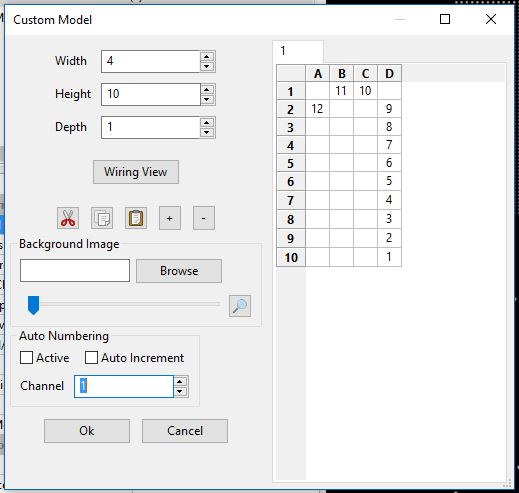
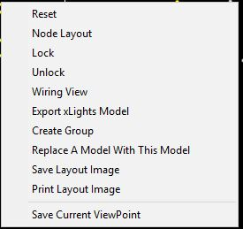

# Custom Model

## **Custom Model Creation**

xLights enables you to define models that do not fit into the concept of predesigned common shapes. For example, a snowman outline, reindeer outline, a singing face, etc. In order to define such a model: Create a new model by selecting the Create new Custom Model icon. Select an area on the Layout screen and drag the mouse across. Note that there won't be anything displayed in the box as the custom model layout has not yet been defined. A new Custom Model will be created with an initial model name of ‘Custom’ or similar. You can rename it to something more suitable. Click within the Model Data box to enter the Custom Model setup window.

A custom model grid will be displayed in which you enter numbers in the grid representing the nodes/channels in your model.

.png>)

.png>)

Change the width and height values to increase the size of the grid to fit the layout.


The depth is used to make a 3D custom model. Future edits to the manual will elaborate on 3D models.


The Right Click Menu Allows you to Flip, Rotate, Compress, Trim Unusued Space, and Shrink Space.

.png>)

For example, to model a custom candy cane with 12 nodes, you could have a grid 4 columns wide and 10 rows high. Place the numbers 1-9 up the right hand side, 10 and 11 in the middle cells in the top row and 12 would go in column A row 2. This is shown below.


There is no undo button, If you mess up your model. Click the Cancel button and none of your changes will be saved.


Click on the Wiring View Button to open a window which will display the nodes and wires as they would be installed in the actual model, based on the layout entered in the grid. Note that the wiring view is shown from the reverse view (back side of the model) below. This is the view as if the pixels are being pushed in from the backside. Right clicking on the wiring view will provide options for changing the background color, font side, and viewing from the front or backside, as well as a few others.

The Right Click on the Custom Menu grid gives options to Flip, Rotate, Compress, Trim Unusued Space, and Shrink Space.

.png>)

Click on the Horizontal Flip or Vertical Flip buttons to shift the nodes in the grid horizontally or vertically, which will also change the output of the Wiring View if selected.

The following image is an example of a Singing Face custom model on a 50 by 50 grid.

To erase a number in a cell, selected the cell and press the Delete key.

You can delete multiple cells by drawing a box around them and then pressing Delete.

.png>)

You can use the ‘+’ and ‘-‘ keys to make zoom in and out, respectively.

To copy a custom model generated in Excel, copy the cells in Excel, select Column A, Row 1 in the custom model grid, and then click on the paste icon. 

Click OK to save the model.

## Custom Model Creation Using A Background Image

From the Layout screen, click on the custom model icon and drag and draw a custom model, as described above. Click on the ... button at the far right of the Background Image Row. A window will open to prompt for the location of an image file. Browse to and select the image.

Alternatively, open the Model Data window to open the Custom Model Window and select the file using the Browse button.

 (1).png>)

Click on the Model Data attribute. This will open up a window with the image in the background which will fill the grid size. Adjust the size of the grid by increasing the width and height values. Click on the ‘+’ and ‘-’ buttons to Zoom in and out of the grid.

The Background image slider can be used to adjust the brightness of the background so that the image is just visible. This will enable you to more easily see the numbers on the image and around the outline. Slide to the left for 100% brightness and to the right for 0% brightness. The magnifying glass at the right side of the slider will toggle the image on and off.

 (1).png>)

You can then start typing the numbers in the positions that the pixels would be located. In this example, it would be around the edges of the snowman and hat.

To erase a number in a cell, selected the cell and press the Delete key.

You can delete multiple cells by drawing a box around them and then pressing Delete.

If you select the Auto Numbering setting to be active, the channel number that is shown in the Channel number box will be added at any cells selected.

If the Auto Increment setting is set to be active, then after each selection, the number is automatically incremented. This is typically the case for smart strings of pixels.


The Channel number in the Channel Number box can be adjusted at any time to control what number is used. This is useful if an cell is accidentally selected.


Click on OK to return to the layout screen at any time to view the Custom Model that has been created.

To edit the custom model, select the Model Data the same as was done with the initial setup. This can be done at any time to edit the model.


Run Check Sequence to indicate if any Custom Models have skipped node numbers.


## **Export Custom Model**

A custom model can be exported so that it can be shared with others, used in different layout, or for adding additional copies of the model to this layout.

To export a Custom Model, select the model and right click. Select Export xLights Model.

You will be prompted to specify a location and filename. Enter the filename click on Save. Note that the xLights custom models use a ".xmodel" file extension.

The export process includes the faces and state definitions, as well as custom models, so these don’t need to be redefined when imported.

## Import Custom Model

This function enables you to create a custom model from a previously exported custom model file (xmodel). This can be previously created by you or shared from another user or vendor.

Click on the ‘Create new Custom model’ icon and then click on the canvas where the new custom model is to be located. You will be prompted for the name and location of the custom model file (xmodel) to import.

Select the file name and a model will be created using information from the custom model file. The model name or other attributes can be edited as needed.

The model will be located at the point selected, and can be resized or moved using the blue connectors similar to any other model.
