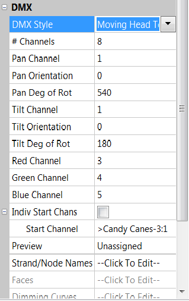

# DMX Model

### **DMX model**

.png>)

The DMX model has a number of different styles and each has a different model representation.

.png>)

After selecting the DMX Mode, a list of Sub Types will display.

### General

.png>)

Used to define any generic DMX Fixture. Can be used for 3/4 Channel RGBW lights or devices like Fog or smoke machines.

### Floodlight/ Area Flood

.png>)

### Moving Head/ Moving Head 3D

.png>)

### Servo

### Skull

.png>)

The first one above is the Moving Head Top view, the next is the Moving Head Side view, the 3rd is the Moving Head Bars view, the 4th is the Moving Head Top Bars and the 5th is the Moving Head Side Bars view.

The # of Channels defines how many channels the model uses.

The Pan attributes define the channel controlling the Pan movement, it’s orientation and the degree it rotates up to.

The Tilt attributes define the channel controlling the Tilt movement, it’s orientation and the degree it rotates up to.

The next three attributes define the channels controlling the red, green and blue colors.
