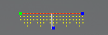

# Icicles Model

### **Icicles Model**

The # of Strings would normally be 1. &#x20;

The Lights per String represents the physical number of light nodes, bulbs or pixels.

You can drag the green or top blue pixel to hang the icicles at an angle and then drag the lower blue pixel to cause the drop to sheer and hand vertically shear.

The drop pattern indicates how the pixels are arranged on each drop and how many.

.png>)

So, if the total lights on the string is 80 and the drop pattern is  3,4,5,4, this indicates that the first drop has 3 nodes, the next 4 , then 5 then 4.

This pattern is then repeated until 80 nodes have been accounted for.

Alternate Nodes will skip every other hole to allow wiring up and down each icicle and prevent wire splicing.

.png>)

## Model Settings

<!-- TODO: screenshot -->

| **Options/Setting** | **Description** |
| --- | --- |
| **Alternate Nodes** | When enabled, skips every other hole so the string can be wired up and back down each icicle drop, avoiding wire splicing. |
| **Drop Pattern** | A comma separated list describing how many nodes are on each successive drop (e.g. `3,4,5,4`). The pattern repeats until all of the lights on the string are accounted for. |
| **Starting Location** | Which end the wiring starts from: **Green Square** (left) or **Blue Square** (right). |

### Export / Import

An Icicles model can be saved to and loaded from an xModel file. Right click the model on the Layout tab and choose **Export xLights Model** to save it, or use the **Import xLights Model** option to recreate it in another layout. This makes it easy to reuse the same icicle configuration across shows or share it with others.
