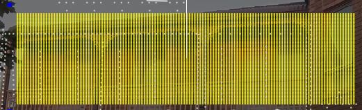

# Matrix Model

### **Matrix Model**

The direction can be defined as horizontal (the most common) or vertical. The ‘# Strings’ refers to the number of controller connections of the matrix. The Nodes/String refers to the number of nodes in each string. The 'Strands/String' is the number of 'rows' or zigzags per string. With AC lights ‘# Strings’ is the number of channels the Lights/string is the lights per string.

The starting location indicates where the matrix is connected to the controller (or where channel 1 of the matrix is).

<figure><figcaption></figcaption></figure>

Above is an example of a horizontal matrix with 16 rows and 50 pixels per row. &#x20;

<figure><figcaption></figcaption></figure>

If the Strands/String is set to '2' it will add a zigzag and there will be 32 rows with 25 pixels per row.

<figure><figcaption></figcaption></figure>

<figure><figcaption></figcaption></figure>

Alternate Nodes will "hop" every other node down and back to have the string start and stop at the same location.

<figure><figcaption></figcaption></figure>
