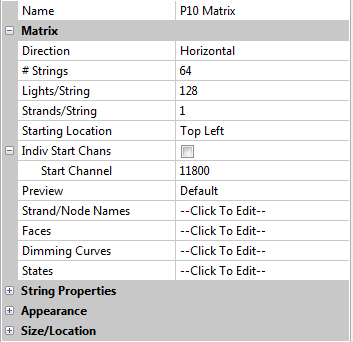

# Matrix Model

### **Matrix Model**

The direction can be defined as horizontal (the most common) or vertical. The ‘# Strings’ refers to the number of vertical columns of the matrix and the Lights/string refers to the number of nodes in each horizontal row. &#x20;

The starting location indicates where the matrix is connected to the controller (or where channel 1 of the matrix is).

This is an example of a horizontal matrix used to define a P10 panel matrix. &#x20;

Each panel is (32 W x 16 H) pixels and the panel matrix is 8 panels in landscape.  The Start channel number is 11800.

For P10 panel matrices run off the BBB using the falcon player, , the matrix must always be defined as a horizontal matrix starting at the top left corner, irrespective of how the panels are physically  oriented.
