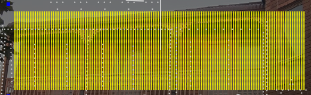

# Matrix Model

### **Matrix Model**

The direction can be defined as horizontal (the most common) or vertical. The ‘# Strings’ refers to the number of controller connections of the matrix. The Nodes/String refers to the number of nodes in each string. The 'Strands/String' is the number of 'rows' or zigzags per string. With AC lights ‘# Strings’ is the number of channels the Lights/string is the lights per string.

The starting location indicates where the matrix is connected to the controller (or where channel 1 of the matrix is).

<figure><figcaption></figcaption></figure>

Above is an example of a horizontal matrix with 16 rows and 50 pixels per row. &#x20;

<figure><figcaption></figcaption></figure>

If the **Strands/String** is set to '2' it will add a zigzag and there will be 32 rows with 25 pixels per row.

<figure><figcaption></figcaption></figure>

<figure><figcaption></figcaption></figure>

**Alternate Nodes** will "hop" every other node down and back to have the string start and stop at the same location.

<figure><figcaption></figcaption></figure>

### Don't Zig Zag

When Enabled all strands will start at the bottom and end at the top or start at left and end at the right. The strands normally "fold" or zigzag at the top and/or bottom.

## Model Settings

<!-- TODO: screenshot -->

| **Options/Setting** | **Description** |
| --- | --- |
| **Direction** | Orientation of the matrix: **Horizontal** (the most common) or **Vertical**. |
| **Alternate Nodes** | "Hops" every other node down and back so the string starts and stops at the same location. Disabled when **Don't Zig Zag** is enabled. |
| **Don't Zig Zag** | When enabled, every strand starts at the bottom and ends at the top (or starts at the left and ends at the right) instead of folding/zigzagging at the ends. Disabled when **Alternate Nodes** is enabled. |
| **Strands/String** | The number of rows (zigzags) per string (1-2500). Setting it to 2, for example, folds each string into two rows. Must divide evenly into Nodes/String. |
| **Starting Location** | Where channel 1 of the matrix connects to the controller: **Top Left**, **Top Right**, **Bottom Left**, or **Bottom Right**. |
