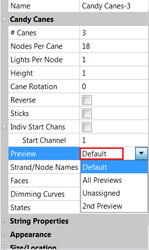
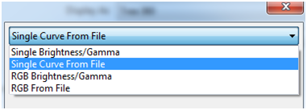
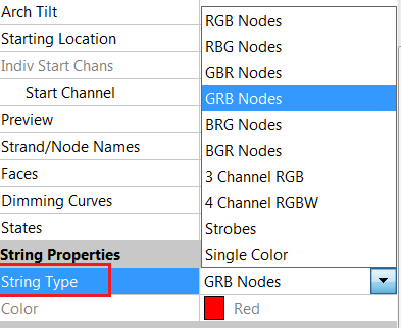

# Model Settings

## **Model Settings**

The model settings determine the physical properties of the model or prop. These setting are critical for how xLights determines the render sequence data, start channels, and controller connections.

.png>)

### **Name**

The name of the model. The Model name can be changed by clicking on the existing name and changing to a new value.

### # Strings

The # of Strings corresponds to the physical number of strings for that model and is generally 1.

### **Nodes/String**

Nodes per String denotes the number of nodes/pixels per string. If your model has 2 strings and 50 node per string, the total number of nodes is 100.

### **Lights/Node**

Lights per Node denotes the number of physical lights per node. (i.e. for pixel strips with 3 LEDs per controller chip, this would be 3).

### **Lights/String**


### **Only available when the 3/4 Channel RGB Selected or Single Color string type is selected.**


Lights per String denotes the number of lights per string. This will be used instead of the Nodes/String and Lights/Node settings.

### Start Location

Location of the first pixel or first channel location. "Green Square" means the starting location is the green square on the layout and "Blue Square" means the starting location is the blue square.

.png>)

## Controller

xLights has two systems to define model start channel locations. If the controller dropdown is set to a controller name specified in the controller tab, the start channel will be auto generated based on the Controller Port and Model Chaining settings. **This is the preferred method of configuring start channels.**

.png>)


If no controller names appear in the dropdown, double check the Auto Layout Model is enabled in the Controller Tab.


## Start Channel

.png>)

The Start Channel corresponds to the starting channel of the first node for the model. xLights will automatically calculate the end channel based on the model settings.

If the controller dropdown is set to "Use Start Channel", by Default, xLights will "chain" all you models together, this means the start channels will just follow the previously model.

In this example, the Start Channel has been set to start immediately after the ‘Candy Canes-2’ model.

.png>)

xLights will automatically calculate the start channel and end channels, and if the ‘Candy Canes-2’ model’s channels change, then the start and end channels for this model will automatically be recalculated.

Click the ellipse button (three periods) to edit the start channel.

.png>)

Model Start Channel can use Absolute, Universe, Start/End of Model or Controller based addressing.

.png>)

### Individual Start Channels

For models with multiple strands or elements, you can specify the start channel for each strand individually if required. This is useful where the channel numbering is not contiguous.

.png>)

## Preview Display

The Preview setting controls whether the model is to appear in the House Preview screen and also which Preview layout screen. Click within the setting to open up a window which lists all the available Previews. If you have created additional Preview layouts, they will be listed in the window.

The ‘Default’ value represents the default preview window.

‘All Previews’ indicates that the Model is to be displayed in all Preview Windows.

‘Unassigned’ indicates that the model will not be displayed as it is not assigned to a Preview window

‘Unassigned’ is sometimes useful where the same physical item has been re-defined using more than one model definition for ease of programming the effects. One of them should have the Preview set to ‘Unassigned’ and the other should not.

The ‘2nd Preview’ is one that has been user created.


There are 4 rules to determine if a model shows up on a Preview.

The model is assigned to the Preview.

1. The model is assigned to All Previews.
2. The model is a member of a model group that is assigned to the Preview.
3. The model is a member of a model group that is assigned to All Previews.


## **Strand / Node Names**

.png>)

Click the ellipse button (three periods) to edit the Strand / Node Names.

.png>)

Each strand and node can have a name assigned to it. This is useful where for example you have single channel models that are grouped together (singing faces, tombstones or DMX props etc). On the sequencer, double clicking on the strand reveals the nodes with meaningful names against them.

## Faces

This setting is used to specify the Faces definition for custom models that support Singing faces.

.png>)

Click the ellipse button (three periods) to edit the Faces.

Functionality has been covered in the Singing Faces section.


[singing-faces](../../../chapter-four-sequencer/singing-faces/)


## Dimming Curves

.png>)

The Dimming Curves setting can be used to change/reduce the brightness of the lights for a specific model. The intensity of the lights is accordingly changed/reduced from its default value of 100%. Use the "Brightness" slider where you can reduce (or increase, but 99% of the time, you reduce) the brightness of the model in the FSEQ. Change the gamma curve of each of the red, blue or green values.

You can select from the options to have a single gamma value or change individual gamma values. You can also select the values from a file, in which case you are prompted for the location of the file.

| **Color**       | RGB Values        |
| --------------- | ----------------- |
| Orange          | R:255 G:37 B:0    |
| Orange          | R:255 G:48 B:0    |
| Darker Orange   | R:255 G:29 B:0    |
| Hot Pink        | R:255 G:0 B:93    |
| Turquoise       | R:8 G:255 B:143   |
| Congo Blue      | R:33 G:0 B:148    |
| J. Winter Blue  | R:0 G:0 B:140     |
| Jade            | R:0 G:181 B:165   |
| JAS Green       | R:86 G:222 B:0    |
| Med Yellow      | R:255 G:247 B:0   |
| Oklahoma Yellow | R:255 G:211 B:0   |
| Bastard Pink    | R:255 G:115 B:107 |
| Grass Green     | R:0 G:109 B:44    |
| Royal Purple    | R:40 G:0 B:123    |


It helps when all of your LEDs have the same wavelength of colors in them. If one set has a darker red or blue you'll get different colors out of those on the same values.


## **State**

.png>)

This setting is used to specify the State definition for custom models. Functionality has been covered in the State Effect section.


[state.md](../../../../effects/off/state.md)


## Sub-Models

.png>)

This setting is used to specify parts of a model to be controlled as if it were its own model. This is used for example if you have a wire frame with 2 arm positions you then can sub model those and control them without the need for adding a 2nd or 3rd model.

Click the ellipse button (three periods) to edit the Sub-Models

.png>)

You will find the sub-model listed as parent model name/sub model name. This can be added to groupings and added to sequencing as a stand alone model.

See the Sub-Models Section for more info.


[sub-models.md](../../sub-models.md)


## **Controller connection**

The Controller Connection settings are used for the Upload to Controller Options in the Controller Tab. Port specify which output of the controller is being used by this model. Protocol is the pixel type or serial type. If a serial protocol is set i.e. DMX the Port setting sets which DMX Port is used on the controller. If the Protocol is set to a pixel protocol i.e. ws2811 the Port setting sets which pixel output is used on the controller board. The additional settings(Null Pixels, Brightness, Gamma, Color Order, etc) will override the setting in the controller if checked. Not all controllers support all settings and some controllers only support one setting per controller port.

.png>)

Upload to Controller is covered under controller tab.

## String properties

#### String Type

The String Type enables you to set or change the ‘RGB’ orientation of your nodes.

The first six options in the list below are used for Pixels - these can also be set in the hardware controller. Dumb pixels are set to either 3 Channel RGB or 4 channel RGB and single “A/C” or store bought fairy lights are set to single channel.

<table data-full-width="false"><thead><tr><th>Type</th><th width="312">Option</th><th>Channels</th></tr></thead><tbody><tr><td>RGB Nodes</td><td>3 Color Pixel Strings. Standard WS2811 Bullet Type Pixels</td><td>3 Channels per Node(Pixel)</td></tr><tr><td>Node Single Color</td><td>Single Color Pixel Strings</td><td>1 Channels per Node(Pixel)</td></tr><tr><td>3 Channel RGB</td><td>3 Channel 'Dumb' RGB Pixel Strings or RGB Flood Lights</td><td>4 Channels per String</td></tr><tr><td>4 Channel RGBW/WRGB</td><td>4 Channel 'Dumb' RGB Pixel String or RGBW Flood Lights</td><td>4 Channels per String</td></tr><tr><td>Strobes</td><td>Single Channel Strobe Bulb, Flashes every 7th frame of sequence</td><td>1 Channels per String</td></tr><tr><td>Single Color</td><td>Single Color String of Lights, Ex: LED/Incandescent Strings. String will responds to that color in the Sequencer.</td><td>1 Channels per String</td></tr><tr><td>Single Color Intensity</td><td>Single Stand String of Lights, Ex: LED/Incandescent Strings. String will responds to ANY color in the Sequencer.</td><td>1 Channels per String</td></tr><tr><td>Superstring</td><td>Multiple Single Color String of Lights. Strings will responds to the colors in the Sequencer.</td><td>Number of Colors * 1 Channels per String</td></tr><tr><td>WRGB Nodes</td><td>RGB and White Color Pixels</td><td>4 Channels per Node(Pixel)</td></tr><tr><td>RGBWW Nodes</td><td>RGB, Cool White, Warm White Color Pixels</td><td>5 Channels per Node(Pixel)</td></tr></tbody></table>

#### Color

The Color setting is used for Single Color/Node Single Color String types to define which color the string responds to. If set to White , then only when the White is on, on the sequence , will it light. If set to say Red , then it will light if Red is on (which is 255,0,0) or if White is on (because White sets 255,255,255 on).

#### RGBW Color Handling



If the RGB color values are all equal ( R == B == G ), the White Channel is used and the RGB are disabled.



If the RGB color channels are used and the White Channel is disabled.



If the White channel are used and the RGB color Channels is disabled.



The Hue value of the RGB color is calculated for the White Channel values RGB Channel is darkened to compensate for the white color value.



If the RGB color values are all equal ( R == B == G ), the White Channel is used and the RGB Channel also output the color data.



## Appearance

The Appearance setting is used to determine how a particular element is displayed when viewed in the Layout, House Preview and Model windows. By increasing the Pixel Size, the appearance of the element (a flood or any other small element) can be made to display a bigger size. The Transparency and Black Transparency values can be used to adjust how opaque or transparent the element is on the display. If the Active option is unchecked the model will not be shown in the layout screen.

Tag Color adds at color indicator before the model name in the sequence tab.

## **Size/Location**

The size/location settings describes where on the Layout screen a model has been place, and its relative size to the model grid. XYZ are the center point of the model. ScaleXYZ determine the size of the model. If a model is locked it cannot be moved. Locked models will have red handles in the layout window.

These values "auto adjusts" as you move or change the size and orientation of the model image and normally does not have to be manually set or adjusted. Model can be locked and unlocked with the right click menu.


In the event that the model has ‘disappeared’ from the screen or has shrunk or is hidden behind another model, then adjusting these values to a larger value can help to locate the model after which the model image can be adjusted as usual.

