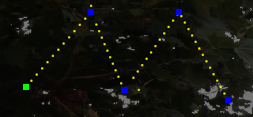
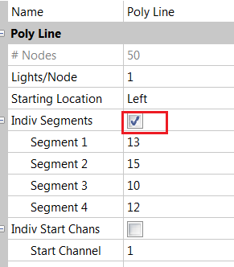
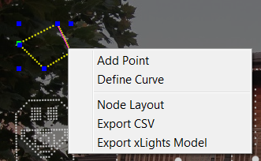
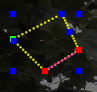
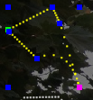
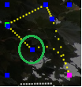
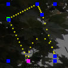
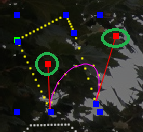
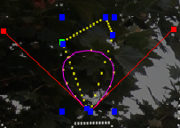

# PolyLine Model

### **PolyLine Model**

The Poly Line model enables several straight line or curved segments to be drawn as one model (rather than having to draw them as individual models).

This model is useful for the roof line , rafters , fences etc where the lines are at an angle to each other.

.png>)

To draw, select this model and drag on the layout as usual. At the end of each segment, click once with the mouse left button, then draw another segment. Left mouse button Click to end the segment.

At the end press the ESC key (after the Click) to deselect the drawing action. You can then grab any of the blue or green pixels and move it around to change the shape of the model image.

The # of Nodes defines the total number of nodes for the entire model, the Lights/Node is normally one and the Starting location can be the left  or Right.

The drop pattern allows the polyline to be used as icicles, this indicates how the pixels are arranged on each drop and how many.

Alternate Drop Nodes will skip every other hole to allow wiring up and down each icicle and prevent wire splicing.

Enabling the Individual Segments attribute selecting will present the different segments that form the poly line model.

You may end up with some in-between lines you don't want. So then check Indiv Segments and start clicking on each segment line in the property grid. It will highlight each segment as you click on them. Once you get to one of the "in-between" lines you don't want just type in a "0" for segment size and it will disappear from the drawing

You can change the number of nodes in each segment.

You can also name all your line segments.

#### Adding Segments &#x20;

To add a segment to an existing model, right click on a segment of the poly line model; the segment color will change to red.

Then select Add Point and a point will be added to the segment. The number of segments will increase by one. You can then work with the new segment and change the number of nodes via the panel.

#### Segment Curves

If you Right click on a segment, the segment color will change to red.

You can then modify the straight line segment into a curved segment by selecting Define Curve.  Grab one edge of the segment and drag it in the direction that you want the line to curve. Then select the other end of the segment and drag it in the direction you want to form a curve. Note the pink dots that denote the end of the curve that you are working with.

Click on the curved line and two straight red bars will be displayed from either end. You can then grab the end of the bar and drag it in any direction to stretch or move the curve.

