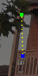
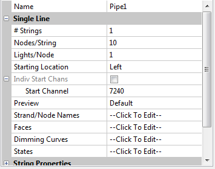

# Single Line Model

### **Single Line Model**

The  ‘# Strings’ is almost always set to 1 .

The Nodes / String indicates how many nodes the string has and the Starting Location indicates whether it runs from left to right or vice versa.

In this example, the single strand model has ten nodes and starts at channel 7240. It runs from left to right.

In the case if you have a vertical setup , then the first channel should match the node connected to the controller or end of the previous model.

Accordingly change the orientation of the model to match that. You can however, reverse the orientation in many hardware controllers as well.
