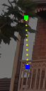
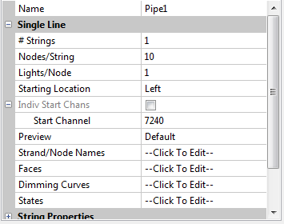

# Single Line Model

### **Single Line Model**

The  ‘# Strings’ is almost always set to 1 .

The Nodes / String indicates how many nodes the string has and the Starting Location indicates whether it runs from left to right or vice versa.

In this example, the single strand model has ten nodes and starts at channel 7240. It runs from left to right.

In the case if you have a vertical setup , then the first channel should match the node connected to the controller or end of the previous model.

Accordingly change the orientation of the model to match that. You can however, reverse the orientation in many hardware controllers as well.

To quickly reverse the wiring direction, right click the model on the Layout tab and choose **Swap Start/End**. This flips the start and end points so the string runs the other way without having to redraw the model.

## Model Settings

<!-- TODO: screenshot -->

| **Options/Setting** | **Description** |
| --- | --- |
| **# Strings** | Number of strings making up the model, typically the number of connections from the prop to your controller. Usually set to 1. Range 1 - 100. |
| **Nodes/String** | Number of nodes on each string (the total pixels per string). For single colour (dumb) strings this is labelled **Lights/String**. Range 1 - 10000. |
| **Lights/Node** | Number of individual lights bundled into each node. Only shown for non-pixel (dumb) string types. Range 1 - 300. |
| **Starting Location** | Which end the wiring starts from, setting the direction the string runs (left to right or right to left). |
