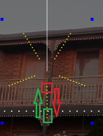
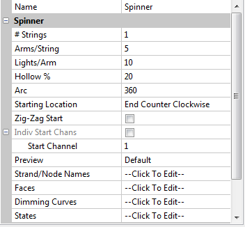

# Spinner Model

### **Spinner Model**

The number of Strings is normally set to 1.

The Arms/String represents the number of Spokes and the Lights/Arm represents the number of nodes on each arm.

The Hollow % is used to control the gap at the base (ie center) of the spinner model.

The Arc can be used to denote whether the model is a 360 degrees spinner or say a 180 (sem circular spinner) or anything in between.

The Starting Location, besides indicating which is the first channel of the model, is also used to denote how it is wired. There are 6 definitions supported (wired from the center, wired from the outside, alternate first/last node and for either whether the nodes move clockwise or counterclockwise ).

When wired from the centre, the starting location must be as indicated with the red rectangle and the pixel direction is outwards on all arms.

When wired at the edge, the starting location must be as indicated with the green rectangle and the pixel direction is inwards on all arms.

The zig zag attribute is to be selected if the wiring is say - inwards on one arm and then outwards on the next and then inwards etc or outwards on one arm and then inwards  on the next and then outwards etc.
