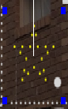

# Star Model

### **Star Model**

The # Strings is normally set to 1 and the Lights/String denotes the total number of nodes on the model. The # of Points describes the points of the star and the startling location indicates where the first node is and which direction it progressive.

.png>)

Starting Location is where the string start location is set to begin.

Outer to Inner Ratio describes the "wideness" of star points.

The Layers attribute value describe the concentric layers in the star. This will create node count settings for each layer. The sum of the node counts must add up to the number of nodes in the model.

.png>)

## Model Settings

<!-- TODO: screenshot -->

| **Options/Setting** | **Description** |
| --- | --- |
| **# Strings** | Number of strings making up the model, typically the number of connections from the prop to your controller. Normally set to 1. Range 1 - 640. |
| **Nodes/String** | Total number of nodes per string. For single colour (dumb) strings this is labelled **Lights/String**. Range 1 - 10000. |
| **# Points** | Number of points on the star. Range 1 - 250. |
| **Starting Location** | Where the first node is and the direction the wiring progresses. Twelve options cover top-centre, bottom-centre, left-bottom and right-bottom starts, each clockwise (CW) or counter-clockwise (CCW), with inside variants for the centre starts. |
| **Layers** | Number of concentric layers in the star. When more than one, a node count is shown for each layer (the innermost labelled **Inside**, the outermost **Outside**); the layer node counts must add up to the total number of nodes. Range 1 - 100. |
| **Outer to Inner Ratio** | Controls the "wideness" of the star points - the ratio of the outer point radius to the inner radius. |
| **Inner Layer %** | Inner hollow size as a percentage, controlling the gap at the centre of the star. Only shown when the star has more than one layer. Range 0 - 100. |
