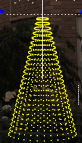
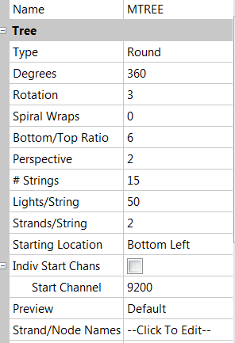

# Tree Model

### **Tree Model**

### Type

The type of tree can either be Round, Flat, or Ribbon. A Round Tree is "classic" tree with a round style base. A Flat Tree will have a flat base and is intended for trees against a wall. A Ribbon Tree is the same as a flat tree but the top is tapered to a single point. Flat and Ribbon Tree are always 180 degrees.

### Degrees

The Degrees attribute indicates whether the tree is a full (360), half (180) or three quarters (270) tree or any other value. This property is only available for Round Trees.

### #/Strings

The # of Strings corresponds to the physical number of strings for that model. Typically an arch or a candy cane will have one string, but models such as a mega tree or a matrix will have many strings.  This should match the number of controller ports you plan to use.

### Nodes/String or Lights/String

The Nodes per String or Lights per String represents the physical number of light nodes, bulbs or pixels in each string of lights. A 8 string tree with 100 Nodes per String would have 800 total lights.

### Strands/String

The Strands per String represents the number of "folds" in each string of lights. If the string of lights will go up once and terminate, the Strands per String is 1. If the string will go up once and return to the bottom the Strands per String is 2.

### Spiral Wraps&#x20;

The Spiral Wraps attribute defines many times a strand is wrapped around the tree. 1.0=one full wrap, 2.5 = 2 1/2 wraps from bottom to top. For spiral tree the # of Strings can be set to 1 and then this can be used to "Spiral Wrap" the tree.

### Bottom/Top Ratio

The Bottom/Top Ratio determines the angle of the tree strands. A ratio of 6 will have a bottom 6 times larger than the top. A ratio of 1 will create a straight vertical cylinder. This can be used to adjust the cone shape of the tree.

### Starting Location

The Starting Location is used to define where the first node starts in a multidimensional model (i.e. a matrix or mega tree).  Set to the default value of Bottom Left if running from left to right or Bottom Right if running from right to left.

In this example, a 360 degree Mega Tree visually has 15 strings of 50 pixels on each string, with 2 Strands per String. This will "fold" the strings once causing the tree to be 30 strands wide and have strands of 25 pixels long.

Each string starts from the bottom, goes up to the top of the tree and loops back down. So half the number of physical strings are required.

The first node is in the front bottom left and starts from channel address 9200.
