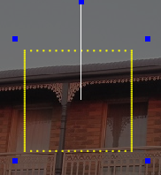

# Window Frame Model

### Window Frame Model

This model is used to represent window frames and door outlines. The # Lights Top is the number of light across the top of the window frame. The # Lights Left/Right is the number of lights per side. xLight will assume the sides are the same length and use this number for both sides. The # Lights Bottom is the number of light across the bottom. This can be set to zero for Door Frames. Direction specified the wiring direction. Starting Location is the location of the first node.

.png>)


Double check the node layout and wiring view to verify your Window Frame definition matches your model. Depending on number of lights per side and the Direction/Starting Location the wiring can change.


## Model Settings

<!-- TODO: screenshot -->

| **Options/Setting** | **Description** |
| --- | --- |
| **# Lights Top** | Number of lights across the top of the frame. Range 0&ndash;1000. |
| **# Lights Left/Right** | Number of lights per side. xLights assumes both sides are the same length and uses this value for both the left and right sides. Range 0&ndash;1000. |
| **# Lights Bottom** | Number of lights across the bottom of the frame. Set to 0 for a door frame (no bottom run). Range 0&ndash;1000. |
| **Starting Location** | Corner where the first node is located: **Top Left**, **Top Right**, **Bottom Left**, or **Bottom Right**. |
| **Direction** | Wiring direction around the frame: **Clockwise** or **Counter Clockwise**. |
