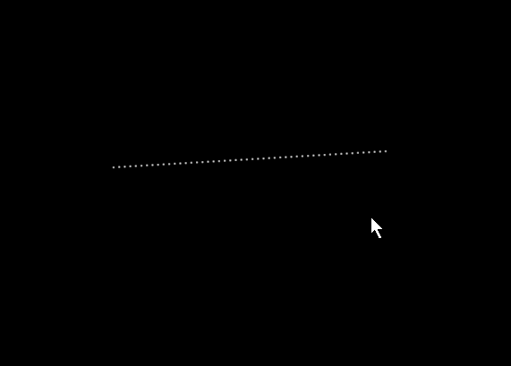

# Moving Model/Objects

### Moving Objects Around

For a single object, you can left click on the object, (it turns yellow) and with the mouse button still held down, drag it around.

To move more than one object around together, press the Control key first and then left click on each object that you want to move as a group (holding down the control key all the time).

Then at the last object, drag to move all the selected objects around together. If you release the Control key  at any time, the objects will not move as a group.

Another way is to Hold down shift, draw a box around the models to move, then let go of shift, and hold down alt, then move the group of models.

In 3D mode a lasso (selection box) is shown while you shift-drag to select props, making it clearer which models will be included in the selection.

While resizing a model, hold the Shift key to retain its aspect ratio so it scales proportionally.

## Linking Models into Sets

Models can be linked together into a "set" so that they move as one. Once models are linked, selecting and dragging any member of the set moves all of its models together, keeping their relative positions. This is useful for props that should always stay together, such as the elements of a single physical prop made up of several models.

<!-- TODO: screenshot -->

## Bulk Edit Rotate

Selecting multiple models, right clicking and choosing **Bulk Edit Rotate X**, **Bulk Edit Rotate Y** or **Bulk Edit Rotate Z** applies a rotation around the chosen axis to all of the selected models at once. Models whose type does not support rotation around the chosen axis are skipped, and xLights reports which models were skipped.

<!-- TODO: screenshot -->

## Aligning Objects

Select a group of objects, right click and select Align (top, bottom etc) to align the selected objects. Which object should they all align to ?

The object you selected first i.e. which will have the blue dots is the key object that others will align to.

When selecting a group, you can press shift, a box opens and you can drag the mouse around the objects to select the group to align.


There is no Undo for this action of dragging and setting alignment.

