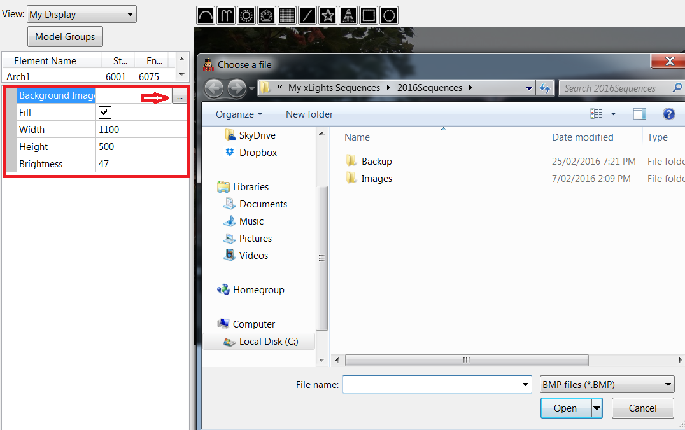

# Objects

## 2D Background Image

The Background image to the layout section i.e your house/yard can be set or changed via the Background Image setting section.

Click where indicated and browse to and select the background image. Change the file type if required.

Adjust the width, height and brightness attributes to your preference. The width and height depends on your screen size and resolution.  If unsure, start with a .jpg or .bmp image with a resolution of around 1100 \* 500 and adjust the width and height for the best fit. The ‘fill’ attribute will scale the image to best fit your window.  Click on the Save button to save the Layout settings.

## 3D Objects

### Mesh

In 3D Mode, Meshes/Renders of your house or other object can be added to the Layout. OBJ file type is currently supported. OBJ files normally require a MTL Materials files that also must be put next to the OBJ file. It is recommended to put both files in your show folder and also remove any spaces from the file name.

Click Add OBJ button and Select the Mesh dropdown.

.png>)

Click the Ellipsis(three dots) Button to select a OBJ file.

.png>)

Once selected, the OBJ will be displayed in xLights.

.png>)

.png>)

### Grid&#x20;

In 3D Mode, Grids can be added to help align models. The grids can be rotated and moved to the desired location.

.png>)

.png>)

### Pictures

In 3D Mode, Multiple Pictures can be added to the Layout. Images can be placed on the ground and also used as the house backdrop.

.png>)

Click the Ellipsis(three dots) Button to select a image file.

.png>)

The file name will appear after a image is selected.

.png>)

.png>)

