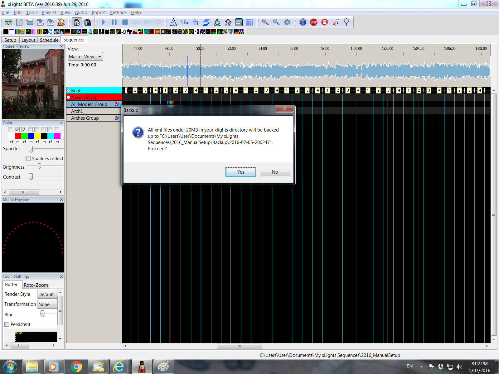
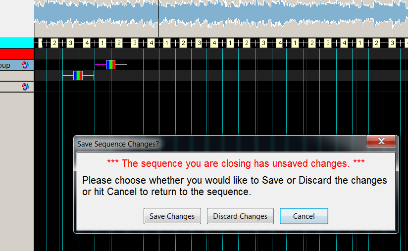

# Backup and Exit

## Backup and Exit

Click on the File Menu.

.png>)

The drop down list has options to backup files, close the sequence and Quit xLights.

Click on the Backup option (or press F10). The backup process will copy all xml files (including key xLights setup and the model definition from your show directory only.

You can also click on Alternate Backup or press F11 to backup to a different location.


This will not back up any images, pictures or media files.


A message is displayed indicating the name and location of the backup files.

Select Yes to accept. Then, from the file menu again, click on Close Sequence.

Then click on Quit.

If the following message is displayed, xLights has detected that there has been a change to the Model or View definitions that has yet to be saved.

Click on ‘Save Changes’ to save.
