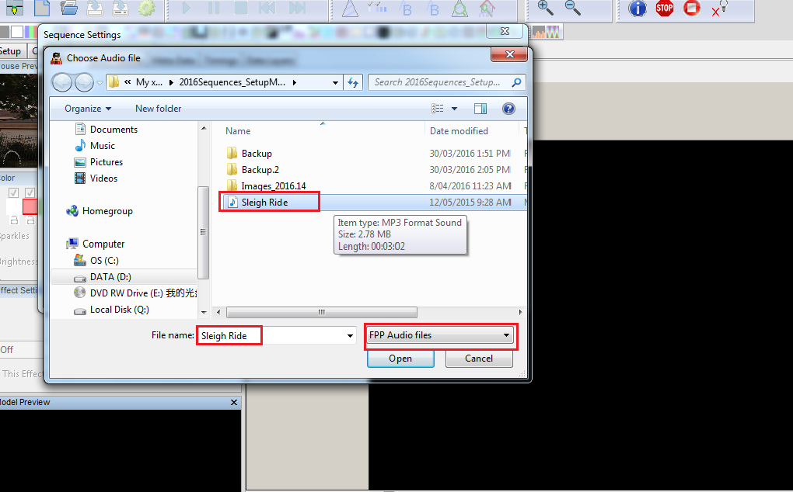
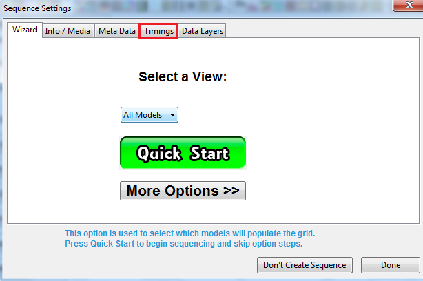
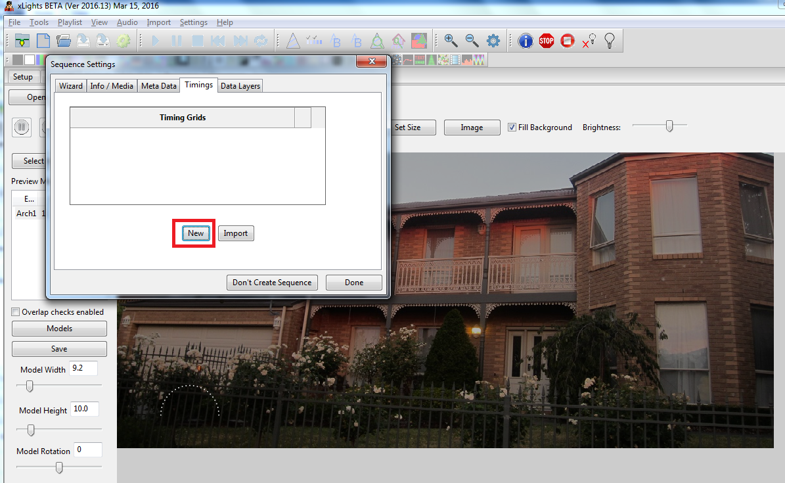
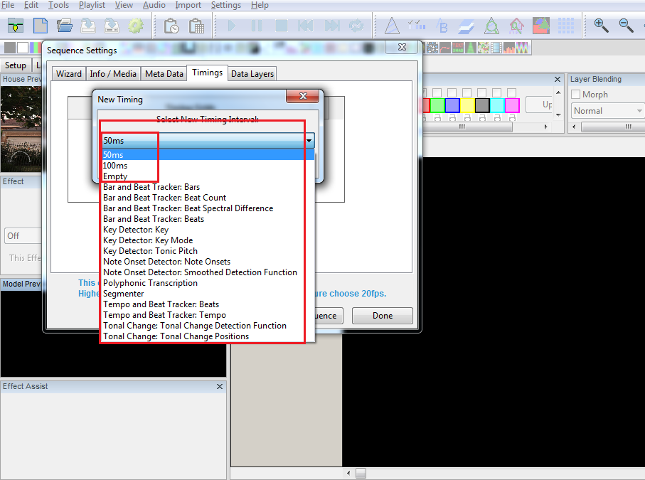
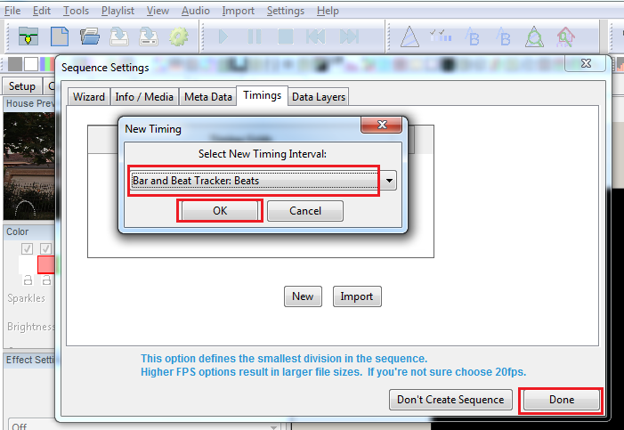
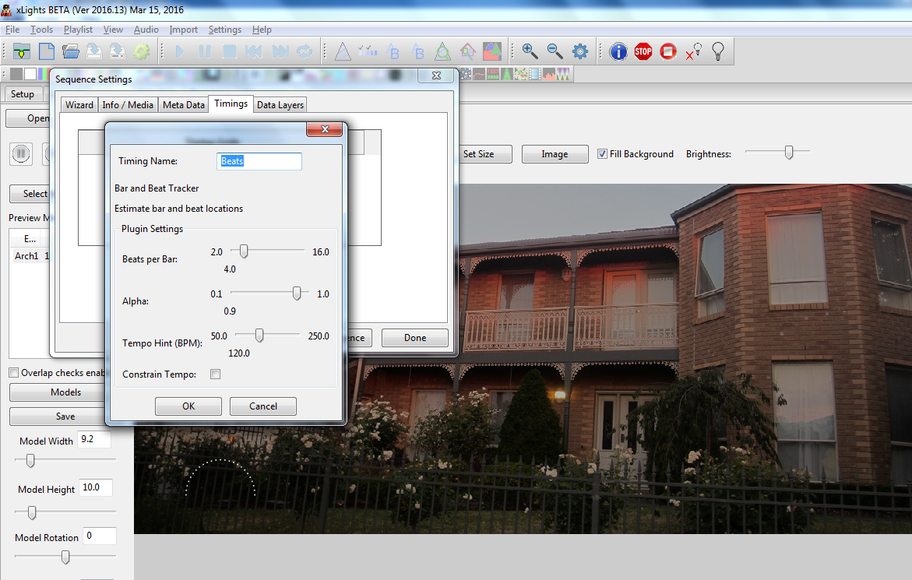
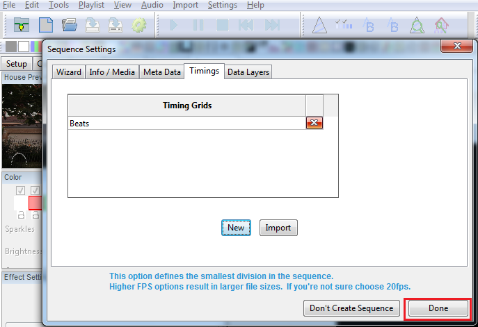

# Creating a New Sequence

## Creating a New Sequence

Click on the New Sequence icon

.png>)

and from the following screen, select Musical Sequence.

 (1).png>)

Select the media file for the audio.

Select the frames per second (FPS) - 50ms is the most commonly used one.

On the next screen, you can click on Quick Start and create timing marks later or you can create timing marks now by clicking on the Timings tabs.

If you forget to do it at this stage and move on to the next screen, you can always create timing marks later by accessing the Timing menu via the Settings menu.

Click on New to create a new Timing Marks Grid.

If the QM Vamp plugins have not been installed, then you will be presented with the following options only. In which case select 50 ms and continue. You can add new or additional Timing Mark intervals at any time later.

If the QM Vamp plugins have been (correctly) installed, then you will be presented with a number of different options.

You can also add new or additional Timing Mark grids at any time later.

Select the Beats Timing Interval.

(You can select any one - but this is one of the common timing marks used). Then Click Ok.

Leave the default values on this screen and click Ok.

You can click on ‘New’ again to add an additional timing mark if you wish or click on Done to move on to the next step.

(This example clicks on Done).
