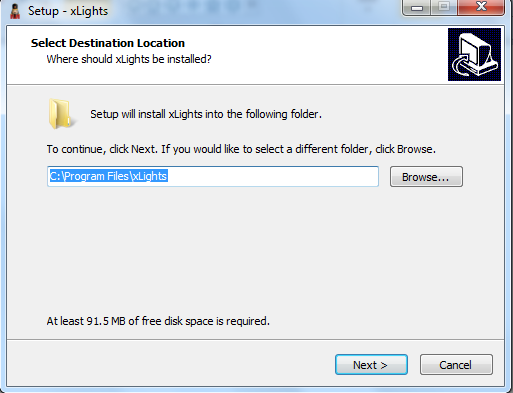
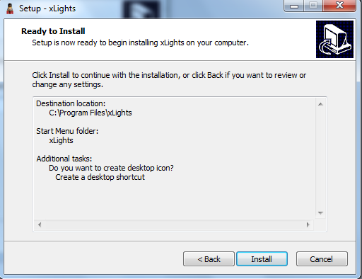

# Installation

## Installation

Download the xLights and QM Vamp Plugins installer from [https://xlights.org/releases/](https://xlights.org/releases/)

.png>)

First, install the Queen Mary VAMP plugins which are used used by xLights.

.png>)

Second, install the xLights, keep the default settings.

 (1).png>)

Installation options are further described in Chapter Three: Installation.
