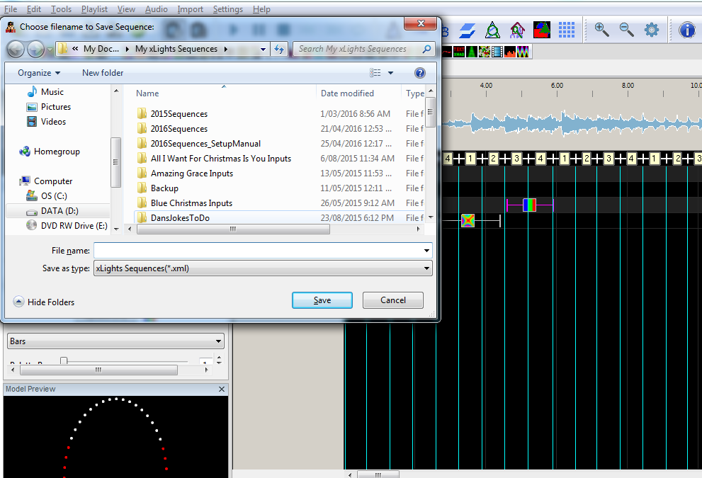

# Saving the Sequence

## Saving the Sequence

Click on the Save or Save As icon to save the sequence.

.png>)

Since this is the first time that the sequence is being saved, the Save As dialogue box opens for a file name to be provided. If saving an audio sequence the filename field will be prepopulated with the Audio file name as the sequence name.

Provide a name and then click Save.
