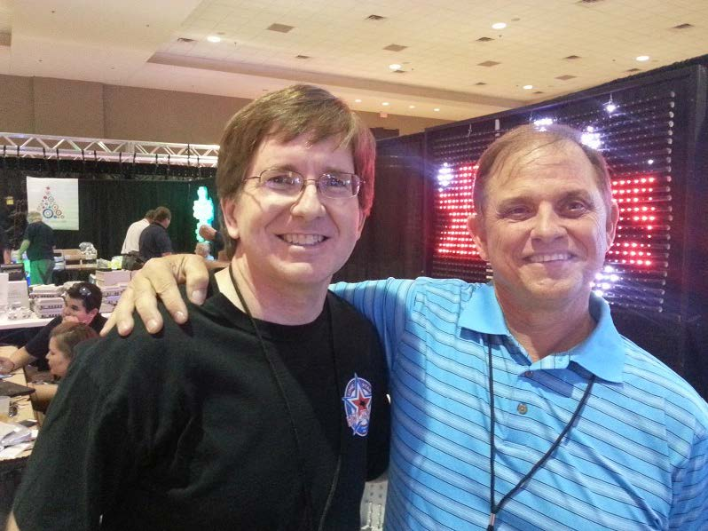
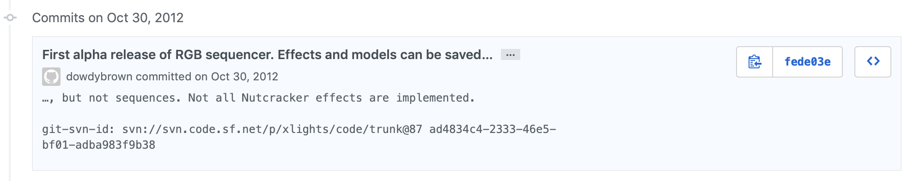

# History

## xLights & Nutcracker

.png>)

 (1).png>)

xLights was created by Matt Brown in early 2010 and was released to the public on September 13th of that year. Matt wanted a program that would reliably play his LOR show after experiencing lagging. His original xLights application consisted of a testing and scheduling module only. The program could control a variety of lighting networks including LOR, D-Light, DMX and Renard. And it also ran under Windows, Mac OS X and Linux. xLights did not have its own sequencer at the time, but could run a mixture of LOR S2 and Vixen sequences.

Nutcracker, originally called rgbsb, was written by Sean Meighan in February 2012. Sean, who was new to animated Christmas lights, wanted an easier way of creating effects on smart RGB devices. He came up with the unique concept at the time of defining a model (megatree, matrix, arches, etc.) and then dropping effects (butterfly, spirals, text, .etc.) onto the model. Sean gave a presentation on the newly renamed Nutcracker software at the Texas Academy in the Summer of 2012. People were excited. Nutcracker could produce either lms or Vixen 2 files. Nutcracker 1 and 2 were developed as a web based php application. To create effects users would log into the web applicaton, define models and apply effects.

.png>)


The Nutcracker name came about because Sean had built two 9' tall nutcrackers for his show and it was suggested he rename his rgbsb application to Nutcracker.


During the Fall of 2012 Matt had contacted Sean and asked if he could port the Nutcracker code into the xLights show player. By January 2013, Matt had taken the web based code that Sean wrote, re-wrote that code into C++ and made Nutcracker a part of xLights. January 2013 xLights v3 was released. Now Nutcracker could be natively ran on Windows, Macintosh or Linux systems. This capability came from Matt's design of his player code. This produced a real time Nutcracker product. For example the Snowflake effect took 5 minutes to generate effects using Nutcracker 2, in Nutcracker 3 (the xLights port), that same effect now took less than 5 seconds. Amazing work by Matt!

 (1).png>)

2013 found both Matt and Sean developing xLights/Nutcracker into a show player and sequencer.

Early into 2014, Matt was hired by Light-O-Rama to develope their software and left the xLights team at that time.

In 2014 Sean had discussions with Dave Pitts about making xLights resemble a video editor with a horizontal timeline, sound file waveform, drag & drop effects and multiple layers. Dave coded up the first Alpha xLights 4.0 in November 2014. In January 2015, Gil Jones and Dan Kulp came on to the team and took over the development from Dave. xLights 4.0 Beta was released on March 20th, 2015. Keith Westley joined the development team in late Summer/early Fall of that year.

.png>)

With the release of version 4.3 on December 17th, 2015, Sean changed the name and dropped the reference to Nutcracker and was simply called xLights. Starting in 2016, xLights dropped the version 4.x numbering scheme and switched to a year/version scheme (i.e 2019.17).

On February 18th, 2017, the sequence player/scheduler was removed making xLights a light sequencer only application.  This capability was replaced with a standalone application called xScheduler created by Keith Westley.

The Summer of 2018 saw the release of the 3D layout and rendering capabilities thanks to Gil Jones.

Both Matt and Sean have always believed their software should be made available free to the lighting community. As such you can download the source code from: [https://github.com/smeighan/xLights](https://github.com/smeighan/xLights).
